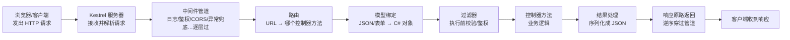
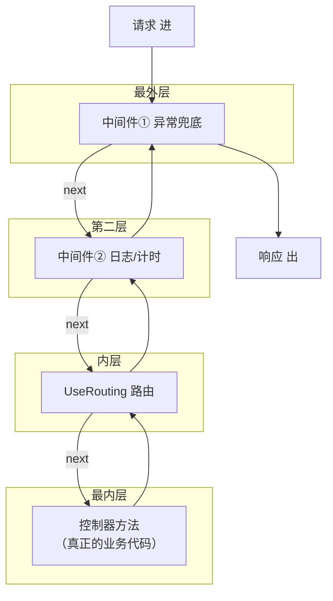
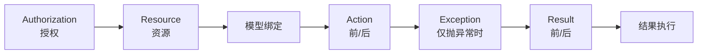

# ASP.NET Core 请求处理管道（新手入门）

- date: 2026-08-03
- tags: [ASP.NET Core, MVC, WebAPI, 中间件, 路由, 模型绑定, 请求管道]
- summary: 面向零基础：一个 HTTP 请求从浏览器发出去，到服务器返回结果，中间到底经过哪些步骤、每步由哪个模块负责，用"流水线"比喻 + 可运行示例讲透 ASP.NET Core 请求流程。

## 概述 / Overview

> 一句话先说结论：
> **一个请求进 ASP.NET Core，就像一件货品走上流水线：先穿过一根"中间件管道"，再由"路由"指路到某个控制器的某个方法，框架自动把参数塞好（模型绑定），方法干完活后，结果再原路一级级送回去。** 整个框架干的事，就是"接收 → 一步步加工 → 返回"。

想象一下去仓库领料：

1. **门卫（服务器/Kestrel）**：听到敲门，收下你的"领料单"（HTTP 请求）。
2. **安检通道（中间件管道）**：一进大厅，先过几道关卡：登记姓名（日志）、查证（鉴权）、测体温（CORS）……每道关卡都能决定"放行"还是"拦下"。
3. **前台指引（路由）**：看了单子，告诉你"领料要去 3 号窗口"（匹配到哪个控制器方法）。
4. **柜台（模型绑定）**：把你的单子内容，一项项填进一张标准表格（把 JSON 变成 C# 对象）。
5. **仓库管理员（控制器方法）**：照着表格干活——查库存、扣库存、记账。
6. **回执（响应）**：干完活，把结果按原路送出大厅，交回你手里。



下面逐步拆开讲。

---

## 核心知识点 / Key Points

### 1. 两大基本概念：请求(Request) 和 响应(Response)

- **Request（请求）**：客户端发给服务器的东西，包含：方法（GET/POST/…）、URL（网址路径）、请求头（Header）、请求体（Body，JSON 等）。
- **Response（响应）**：服务器回给客户端的东西，包含：状态码（200 成功 / 400 参数错 / 500 服务器错）、响应头、响应体（JSON 等）。

**你只需要记一条：整个过程就是"客户端发请求 → 服务器加工 → 返回响应"。**

### 2. 谁在监听端口？—— Kestrel 服务器

程序启动后，ASP.NET Core 内置的 **Kestrel**（一个轻量 HTTP 服务器）开始监听端口（默认随机，可指定如 `http://localhost:5210`）。

- 它是请求的**第一站**：收到网络数据 → 解析成 Request 对象。
- 也是响应的**最后一站**：把 Response 写成网络字节流发出去。
- 我们不用管它，但要知道"**请求是它接进来的**"。

### 3. 中间件管道（Middleware Pipeline）—— 本主题的绝对核心

**中间件（Middleware）** 是管道里一个个"关卡"。程序启动时你用 `app.Use(...)` 把它们**按书写顺序**排成一队：

```csharp
app.Use(中间件A);   // 第一个
app.Use(中间件B);   // 第二个
app.UseRouting();   // 路由也是中间件之一
app.MapControllers();
app.Run();          // 开始监听
```

每个中间件长这样（核心就三个动作：**进** → **next() 放行** → **出**）：

```csharp
app.Use(async (context, next) =>
{
    // 1. 请求经过这里时先执行的代码（"进门"）
    // 2. 调 next() 把请求交给下一个中间件
    await next();
    // 3. next() 返回后执行的代码（"出门"，此时响应已经在往回走了）
});
```

**关键心智模型：洋葱/套娃。** 请求从外往里一层层"进"，响应从里往外一层层"出"：



执行顺序：**先走完所有中间件的"进门"代码 → 到控制器 → 再逆序走完所有中间件的"出门"代码。**

> 所以中间件①写在最前，就"包"住了后面所有环节——异常兜底、计时都靠这个特性实现。**中间件顺序 = 行为**，这是新手最容易忽略的一点。

### 4. 路由（Routing）—— 决定"找谁干活"

请求穿过若干中间件后，遇到 **UseRouting**。它负责回答一个问题：

> 这个 URL（比如 `/api/inbound/receive`）该交给**哪个控制器、哪个方法**？

- 控制器方法上标注的 `[HttpGet]` / `[HttpPost]` / `[Route(...)]` 就是"路由模板"，用来和 URL 对号入座。
- 匹配上之后，路由并不会自己干活，而是把请求"指派"给那个方法——这个"指派对象"叫 **终结点（Endpoint）**，由 `MapControllers()` 把控制器里的方法注册成终结点。

### 5. 模型绑定（Model Binding）—— 自动填参数

路由选中方法后，框架开始"填参数"：把请求里的数据，塞进方法的参数对象。

- `[FromBody]`：从请求体的 **JSON** 反序列化出对象（WebAPI 最常见，前端传 `{"sku":"SKU-1001","qty":120}`，框架自动填进 `InboundOrder` 类的属性）。
- `[FromQuery]`：从 URL 问号后面的参数取（如 `/api/inbound?sku=SKU-1001`）。
- `[FromRoute]`：从 URL 路径段取（如 `/api/inbound/{id}` 里的 id）。

**你不用写任何解析 JSON 的代码，框架全帮你干了。** 绑定完还能用 `ModelState.IsValid` 做校验（[ApiController] 会自动对不合法请求返回 400）。

### 6. 过滤器（Filters）—— 在方法周围"插一脚"

过滤器是围绕"控制器方法"的更细粒度钩子，在**方法执行前/后**运行。常见用途：鉴权、日志、异常处理、统一包装响应。

```csharp
public class 日志过滤器 : IAsyncActionFilter
{
    public async Task OnActionExecutionAsync(context, next)
    {
        // 方法执行前
        await next();   // 执行方法本体
        // 方法执行后
    }
}
```

和中间件的区别：**中间件管"整个请求的来回路"；过滤器管"某个方法的前后"**。过滤器在路由选完方法之后才轮到它。

### 6.1 过滤器的五大类型

按执行顺序（洋葱，最外 → 最内）：

| 类型 | 接口 | 执行时机 | 典型用途 |
|------|------|---------|---------|
| **Authorization 授权** | `IAuthorizationFilter` | **最先执行** | `[Authorize]` 就是它（AuthorizeFilter） |
| **Resource 资源** | `IResourceFilter` | 授权后、模型绑定**前**，包裹后续全部 | 缓存、连接池、短路返回 |
| **Action 动作** | `IActionFilter` | 模型绑定后，方法执行前/后 | 日志、参数校验、事务 |
| **Exception 异常** | `IExceptionFilter` | 方法执行抛异常时 | 统一错误响应 |
| **Result 结果** | `IResultFilter` | 结果执行前/后 | 包装响应、统一格式 |



### 6.2 想"在鉴权之前做操作"怎么办？

先纠正一个常见误解：**`[Authorize]` 的真正判定发生在中间件层（`UseAuthorization()`），而不是 MVC 过滤器层。** 开启 `UseAuthorization()` 时，它会在「到达 MVC 过滤器管道之前」就对挂 `[Authorize]` 的接口判定，未通过直接短路 401——所以**自定义 `IAuthorizationFilter` 根本抢不到 `[Authorize]` 前面**（它排在中间件 401 之后）。

因此正确的是：**如果要抢在 `[Authorize]` 之前做操作，就用一个中间件，放在 `UseAuthentication()` / `UseAuthorization()` 之前**

```csharp
app.UseRouting();
app.UseAuthentication();

// ★ 预鉴权中间件：此刻还没开始鉴权，天然在 [Authorize] 之前
app.Use(async (ctx, next) =>
{
    var endpoint = ctx.GetEndpoint();          // 还能拿到"目标终结点"
    // 记录来源、注入租户、IP 白名单、生成请求 ID…
    await next();
});

app.UseAuthorization();
```

两次测试的关键区别（示例项目里 `GET /api/inbound/secure` 可复现）：

| 环节 | `[Authorize]` 判定在哪触发 |
|------|---------------------------|
| 中间件：预鉴权（放在 `UseAuthorization()` 之前） | 一定会先执行 ✅ |
| MVC 过滤器：自定义 `IAuthorizationFilter` | 排在后头——若 401 在中间件层短路，它**根本不会执行** |

> **那自定义 `IAuthorizationFilter` 什么时候用？** 它针对的是"**能到达 MVC 管道**的请求"：在所有模型绑定和业务代码之前，做一层额外检查（白名单、注入租户、生成请求 ID）——但它已**过了**中间件层的鉴权。若想「先于其他自定义授权过滤器」，则靠作用域（全局 → 控制器 → Action）与 `Order` 排序。
>
> 一句话：**在 `[Authorize]` 之前 → 用中间件；在 MVC 管道里的第一道关卡 → 用自定义授权过滤器。**（Resource 过滤器排得更靠后，两者都不是万能答案，先想清楚想抢在哪一步之前。）

### 7. 控制器方法（Controller Action）—— 真正的业务代码

到这里，你的业务代码终于被执行。它把服务（如库存服务）干完活的结果，包装成 `Ok(xxx)`、`BadRequest()` 等"结果对象"返回。

```csharp
[HttpPost("receive")]
public IActionResult Receive([FromBody] InboundOrder order)
{
    var message = _stock.AddStock(order);  // 业务逻辑（通常抽到 Service 层）
    return Ok(new { order.OrderNo, message });  // 返回 200 + JSON
}
```

### 8. 结果处理与序列化（Result Execution）

MVC 拿到 `Ok(obj)` 后：
1. 把对象用 **JSON 格式化器**（默认 System.Text.Json）序列化成 JSON 字符串；
2. 设置状态码、Content-Type 等响应头；
3. 写进 Response.Body。

### 9. 响应原路返回

响应写完后，沿中间件管道**逆序**穿过每一个"出门"代码（计时器在这里算总耗时），最终由 Kestrel 发送给客户端。

### 10. 依赖注入（DI）—— 谁创建服务

控制器构造函数里要的 `StockService`，由 **DI 容器**在创建控制器实例时自动"喂"进去。`builder.Services.AddScoped<...>()` 就是登记"我能创建谁"。这保证了控制器不用自己 `new` 依赖，方便测试和替换。

---

## 代码示例 / Code Example

可运行完整代码见同级目录 → [RequestPipeline/](./RequestPipeline/)

运行方式：`dotnet run`，然后按该目录 README 里的 curl 命令发请求（见 [RequestPipeline/README.md](./RequestPipeline/README.md)）。

这个示例是一个"收货入库"的 WebAPI，演示管道完整旅程：

1. 中间件①（异常兜底）+ 中间件②（日志/计时）+ 中间件③（路由）+ 中间件④（预鉴权）+ 中间件⑤（认证/授权）按顺序注册，直观看到"进→出"。
2. `POST /api/inbound/receive`：演示 路由匹配 → 预鉴权 → 模型绑定（JSON→InboundOrder）→ 授权过滤器 → 全局过滤器 → 控制器 → Service → 结果序列化。
3. `GET /api/inbound/trace`：把"管道步进清单"原样返回，**亲眼看到每一步顺序**：

```text
【中间件①】请求进入
【中间件②】收到请求：POST /api/inbound/receive
【中间件④】鉴权开始前！目标终结点：…Receive
[授权过滤器] PreAuthFilter：MVC 管道内的第一道授权关卡
[过滤器] 进入 Action 前
[过滤器] Action 执行完，返回类型：OkObjectResult
【中间件②】响应离开，耗时 xx ms
【中间件①】正常返回
```

4. `GET /api/inbound/boom`：故意抛异常，看中间件①用 try/catch 兜底并返回友好 JSON（而不让进程崩溃）。
5. `GET /api/inbound/secure`：挂了 `[Authorize]` 必然 401；但 `GET /api/inbound/trace` 会显示「预鉴权中间件」已在 `[Authorize]` 判定之前执行——直观证明**在鉴权之前做事要用中间件，而不是过滤器**（对应 6.2 节）。

建议动手改一改（体会"顺序即行为"）：在 `Program.cs` 里追加一个 `app.Use(...)` 中间件；把日志中间件挪到 `UseRouting()` 之后，观察它还能不能先于控制器打日志；把「预鉴权中间件」从 `UseAuthorization()` 之前挪到**之后**，再访问 `secure`，看它还能不能出现在 trace 里。

---

## 面试回答话术 / Interview Q&A

> 每条约 30~60 字，可直接背。先自己默答，再看答案。

**Q1：ASP.NET Core 一个请求从进来到返回，完整流程是什么？**
A：Kestrel 接收入口，依次穿过中间件管道（日志/鉴权/异常兜底等），经路由选中控制器方法，模型绑定填好参数，过滤器前后钩子，方法执行返回结果，再逆序原路返回。

**Q2：什么是中间件？什么是中间件管道？**
A：中间件是处理请求的一个环节，用 `app.Use` 按顺序排队成管道；每个中间件调 `next()` 放行给下一个，请求层层进入、响应层层返回，顺序即行为。

**Q3：为什么中间件顺序很重要？**
A：写在前面就"包住"后面所有环节，可做全局异常兜底、计时；顺序错了，后面的中间件收不到请求或兜底失效，所以注册顺序决定处理范围。

**Q4：路由的作用是什么？**
A：根据 URL 和 HTTP 方法，把请求匹配到对应的控制器方法（终结点）；`UseRouting` 负责匹配，`MapControllers` 负责把控制器方法注册成终结点。

**Q5：模型绑定是做什么的？**
A：把请求体/查询串/路由段的数据自动填进方法参数对象，如 `[FromBody]` 把 JSON 反序列化成 C# 对象；不用手写解析代码，绑定后可走 ModelState 校验。

**Q6：中间件和过滤器有什么区别？**
A：中间件管整个请求的来回路，注册在管道里对所有请求生效；过滤器围绕单个控制器方法执行前后，路由选完方法后才触发，粒度更细。

**Q7：Controller 为什么能自动拿到 StockService？**
A：依赖注入。DI 容器在创建控制器实例时，把构造函数里声明的服务自动传入，控制器只声明"我要什么"，不负责创建，便于测试和替换。

**Q8：[ApiController] 有什么用？**
A：开启 WebAPI 约定：自动推断参数绑定来源、自动对 ModelState 非法请求返回 400、自动 400 响应格式，省去大量样板校验代码。

**Q9：如何实现在鉴权（[Authorize]）之前做操作？**
A：用中间件放在 UseAuthorization() 之前，此刻鉴权未开始、还能 GetEndpoint() 做租户注入/白名单；自定义授权过滤器在中间件 401 短路之后，抢不到前面。

---

## 参考链接 / References

- [微软官方 - ASP.NET Core 请求处理管道](https://learn.microsoft.com/zh-cn/aspnet/core/fundamentals/middleware/)
- [微软官方 - ASP.NET Core 路由](https://learn.microsoft.com/zh-cn/aspnet/core/fundamentals/routing/)
- [微软官方 - 模型绑定](https://learn.microsoft.com/zh-cn/aspnet/core/mvc/models/model-binding)
- [微软官方 - 过滤器](https://learn.microsoft.com/zh-cn/aspnet/core/mvc/controllers/filters)
- [微软官方 - 依赖注入](https://learn.microsoft.com/zh-cn/aspnet/core/fundamentals/dependency-injection)
- [微软官方 - 教程：创建 Web API](https://learn.microsoft.com/zh-cn/aspnet/core/tutorials/first-web-api)

---

## 踩坑记录 / Troubleshooting

| 现象 | 原因 | 解决办法 |
|------|------|----------|
| 请求被拦截，找不到路由 404 | 忘了 `app.MapControllers()` 或路由属性拼错 | 检查控制器标了 `[ApiController]` / `[Route]`，并在管道末尾 `MapControllers()` |
| 日志/鉴权中间件不生效 | 中间件注册在 `UseRouting()` 之后，且针对的是"还没走到路由"的请求 | 全局性质的中间件（日志、异常、鉴权）尽量写在管道最前面 |
| POST JSON 到接口返回 415/400 | 忘了 `Content-Type: application/json`，或模型绑定字段对不上 | curl 加 `-H 'Content-Type: application/json'`；核对 JSON 属性名与模型一致 |
| 中间件代码报"响应已开始"异常 | 已经在 `next()` 之后尝试修改响应头/状态码 | 响应头必须在 `await next()` 之前写；之后只能改响应体 |
| 端口被占用 | 上一次 `dotnet run` 没停干净 | 用 `ASPNETCORE_URLS=http://localhost:5210` 指定端口，或停掉旧进程 |
| 异常时客户端收到 500 裸错误 | 没配全局异常处理 | 用最外层 try/catch 中间件或 `UseExceptionHandler` 统一转成友好 JSON |
