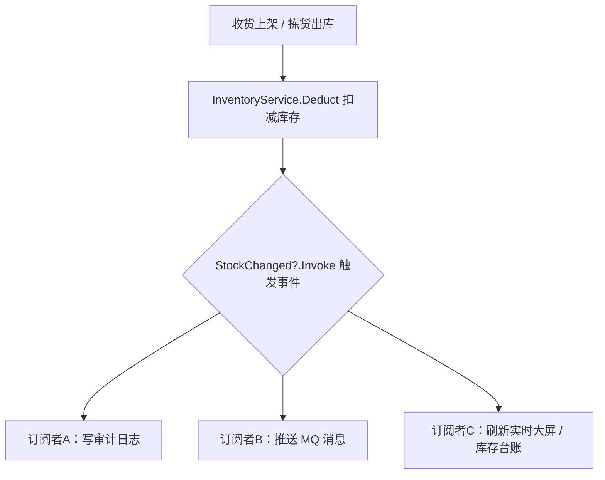
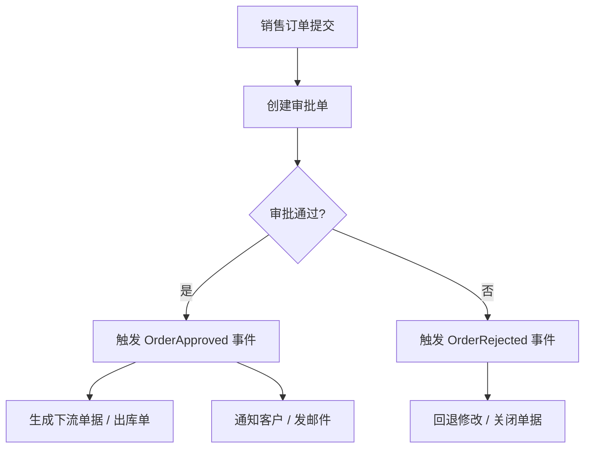

# C# 委托和事件（新手入门）

- date: 2026-08-02
- tags: [C#, delegate, event, 委托, 事件]
- summary: 面向零基础，用生活比喻 + 一步步代码示例讲解委托和事件两兄弟，说明它们是什么、为什么需要、怎么用、有什么区别。

## 概述 / Overview

委托（delegate）和事件（event）是 C# 里两个"让你把方法当成变量传递、调用"的机制。

一句话先记住结论：

> **委托 = 方法的"遥控器"**：把某个方法存进一个变量，到时候再用这个变量去调用它。
> **事件 = 加了"门禁"的委托**：别人只能"订阅/退订"，不能随便替你乱触发。

把它们想象成"外卖电话本"和"订阅通知"会很好懂，下面逐步展开。

---

## 核心知识点 / Key Points

### 1. 为什么需要委托？

大多数时候我们直接调方法：

```csharp
void Greet() { Console.WriteLine("你好"); }
Greet();            // 直接调用
```

问题来了：**想不想把 `Greet` 这个方法本身"传出去"给别人用？**

比如：一个"按钮"类并不知道点了之后要干嘛，它只想说"我什么都没干，你来告诉我该干什么"。这时候就需要把"方法"当成参数传进去。C# 里"方法的类型"就是**委托**。

### 2. 什么是委托（delegate）？

委托就是**定义一种方法的"签名模板"**（返回类型 + 参数），凡是符合这个模板的方法，都能塞进这个委托变量。

**定义委托（相当于发明一种"方法格式"）：**

```csharp
// 定义一个委托类型：输入两个 int，返回 int
delegate int MathOp(int a, int b);
```

**使用委托（像用变量一样存放方法）：**

```csharp
MathOp op;          // 声明一个委托变量
op = Add;           // 把 Add 方法放进去（要求签名一致）
int result = op(3, 4); // 通过委托调用 -> 7
```

`Add` 只要长这样就能放进去：

```csharp
int Add(int a, int b) => a + b;
```

**委托还支持"多播"：一个委托可以同时装好几个方法，调用时按顺序全执行。** 用 `+=` 添加、`-=` 移除。

### 3. 内置委托，省得自己声明

常用两个官方自带：

```csharp
Func<int, int, int> op;          // 有返回值，最后一个参数是返回值类型
Action<string> log;              // 无返回值
Predicate<int> isBig;            // 返回 bool，常用于判断
```

有了它们，多数情况不用自己写 `delegate` 声明。

### 4. 匿名方法与 Lambda

不用单独写一个命名方法，可以直接"临时写一个方法贴上去"：

```csharp
var greet = (string name) => Console.WriteLine($"你好，{name}");
greet("小明");   // 你好，小明
```

`(参数) => 表达式` 就是 **Lambda（箭头函数）**，是委托最常用的写法。

### 5. 什么是事件（event）？

事件 = **带"访问控制的委托**"。它外面只能做两件事：

| 操作 | 权限 |
|------|------|
| `+=` 订阅（注册处理方法） | 外部允许 |
| `-=` 退订（移除处理方法） | 外部允许 |
| `触发`（调用事件） | **只允许在类内部** |

这样就能保证：外界不能随便 `button.Click()` 假叫，只有发生真正点击时才触发。

### 6. event 和 delegate 到底差在哪？

| 对比 | delegate | event |
|------|----------|-------|
| 能否在外面直接 `调用` | 可以 | **不可以**，只能在类内部触发 |
| 能否从外面替换整个值 `=` | 可以 | 不能整体赋值，只能用 `+=/-=` |
| 主用途 | 作为方法参数/回调 | 表达"某件事发生了"的通知 |

**一句话**：event 是更安全的委托，专门用来当"通知广播"。

### 7. .NET 事件约定

C# 官方习惯用 `EventHandler` 与 `EventArgs`：

- `System.EventHandler`：无数据的事
- 带数据：`EventHandler<T>`，自定义类继承 `EventArgs`
- 触发事件的标准写法 `事件?.Invoke(this, e)`（`?.` 表示：若没有订阅者就不执行，避免空引用异常）

---

## 实际业务场景 / WMS·ERP 应用

抽象概念容易忘，这里放到真实的 WMS/ERP 业务里看它到底在哪用。

### 场景 A：库存变动事件广播（最典型）

收货上架、拣货出库后，有**一堆下游**要响应"库存变了"，用 `event` 解耦（谁订阅谁关心，发布者不用知道有谁）：

```csharp
class InventoryService
{
    public event EventHandler<StockChangedEventArgs>? StockChanged;
    void Deduct(string sku, int qty)
    {
        /* 扣库存逻辑 */
        StockChanged?.Invoke(this, new StockChangedEventArgs(sku, qty));
    }
}
// 订阅者各自关注自己那摊事
stock.StockChanged += (s, e) => _mq.Publish("stock.changed", e);    // 推消息队列，同步下游系统
stock.StockChanged += (s, e) => _audit.Log($"扣减 {e.Sku} {e.Qty}"); // 写审计日志
stock.StockChanged += (s, e) => _ws.NotifyRealtime(e);              // 大屏/仓库实时看板刷新
```



### 场景 B：单据状态流转（审批流）

采购单、销售单状态流转时触发 `StatusChanged`，分别驱动"通知审批人""生成下流单据""发邮件"。



### 场景 C：单据保存前后钩子（扩展点）

ERP 里常见 `IBeforeSave / IAfterSave`，用委托管道按顺序执行：校验 → 计算 → 过账。第三方插件只需 `+=` 挂自己的逻辑，不改核心代码。

### 场景 D：耗时任务进度回调

大批量导入、盘点差异处理、报表导出时，用 `Action<int, int> progress` 作为方法参数，把"已完成/总数"实时回传 UI 进度条。

### 场景 E：主数据变更通知

物料、客户主数据改版后，通知各模块刷新缓存或重建索引。

### 一句话总结

> **一个动作发生后有多方要"响应" → 用 event 广播（如库存变动）**
> **执行中途需要把某段逻辑"交出去" → 用 delegate 参数（如校验回调、进度回调）**

---

## 代码示例 / Code Example

可运行完整代码见同级目录 → [DelegatesAndEvents/](./DelegatesAndEvents/)

运行方式：`dotnet run`（见该目录 README）。

演示全部取材于 WMS 业务流程，一一对应上面的知识点：
1. 自定义委托 → 出库运费按不同规则计算（按重量 / 按数量 / 按件数）
2. 委托做参数（回调）→ 库存导入时回传进度
3. 多播委托 → 出库单过账后按顺序执行：生成拣货任务 → 扣减库存 → 写台账
4. 内置 `Action` / `Func` + Lambda → 计算安全库存、写操作日志
5. 事件 → 库存扣减触发 `StockChanged`，订阅者：写审计日志 / 推送消息 / 刷新看板（含退订演示）
6. 门禁对比 → 同样场景下 `delegate` 字段外部可乱触发，而 `event` 外部不可触发

建议动手改一改：再订阅一个库存变动处理方法、把退订那行去掉，看输出变化。

---

## 面试回答话术 / Interview Q&A

> 每条约 30~60 字，可直接背。先自己默答，再看答案。

**Q1：什么是委托？**
A：委托是"方法的类型"，可把方法当作变量传递、保存、调用；用 `delegate` 声明，支持 `+=` 多播，调用时按订阅顺序执行。

**Q2：什么是事件？和委托有什么区别？**
A：事件是加了门禁的委托：外部只能 `+=`/`-=` 订阅退订，触发仅限类内部，防止外部伪造或清空；普通委托则完全开放。

**Q3：什么时候用 event，什么时候用 delegate？**
A：表达"某件事发生了"且有多方响应、只在类内触发时用 event；需要把逻辑交出去（回调、校验、管道）时用 delegate 或内置 Action/Func。

**Q4：Func、Action、Predicate 的区别？**
A：内置委托。Func 有返回值，最后一个泛型参数是返回类型；Action 无返回值；Predicate 返回 bool，多用于筛选判断。

**Q5：Lambda 表达式是什么？**
A：匿名函数，形如 `(参数) => 表达式`，用于就地定义一个方法给委托；配合委托最常用，简洁且能捕获外部变量。

**Q6：触发事件时为什么用 `?.Invoke()`？**
A：`?` 空安全调用——没有订阅者时跳过，避免空引用异常；这也是 .NET 事件触发的标准写法。

**Q7：事件订阅会不会导致内存泄漏？**
A：会。发布者持有了订阅者引用，不退订则无法 GC；发布者是静态/单例等长生命周期对象时，订阅者应在释放时 `-=` 退订。

---

## 参考链接 / References

- [微软官方文档 - 委托](https://learn.microsoft.com/zh-cn/dotnet/csharp/delegates-overview)
- [微软官方文档 - 事件](https://learn.microsoft.com/zh-cn/dotnet/csharp/events-overview)

---

## 踩坑记录 / Troubleshooting

| 现象 | 原因 | 解决办法 |
|------|------|----------|
| 触发事件报"空引用异常" | 事件没订阅者时仍直接调用 | 用 `?.Invoke(...)` 空检查 |
| 事件在外面被调用报错 | `event` 不允许类外触发 | 触发逻辑移到定义类的内部方法里 |
| `委托的签名"对不上"报编译错误 | 传的方法返回/参数必须严格匹配 | 统一用内置 `Action`/`Func` 或保证签名一致 |
| 忘了 +-= 顺序错误 | 多播是"按加入顺序执行" | 想清楚先后依赖再订阅 |