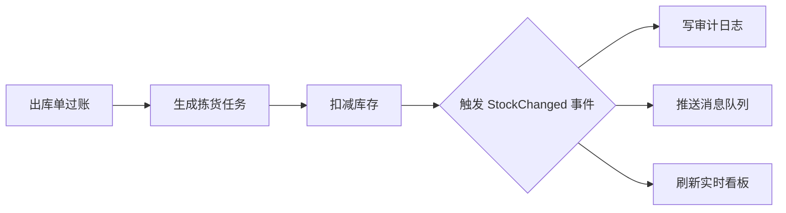

# DelegatesAndEvents 演示项目

配套笔记：《C# 委托和事件（新手入门）》 → 返回 [../DelegatesAndEvents.md](../DelegatesAndEvents.md)

## 依赖环境

- .NET SDK 10 或更高（`dotnet --version` 查看）

## 运行

```bash
dotnet run
```

## 业务流程总览



本示例把"库存变动后的多方响应"用 `event` 广播实现；运费计费、导入进度、过账连锁用 `delegate` 实现。

## 演示内容（对应笔记知识点）

| 演示 | WMS 业务场景 | 对应知识点 |
|------|-------------|-----------|
| 1 | 出库运费计费（按重量/按数量） | 自定义委托、方法赋给变量 |
| 2 | 库存批量导入回传进度 | 委托做参数（回调）、Lambda |
| 3 | 出库单过账连锁动作 | 多播委托、`+=`/`-=` |
| 4 | 安全库存计算、操作日志 | 内置 `Action` / `Func` |
| 5 | 库存变动广播（审计/推送/看板） | `event` 订阅与触发 |
| 6 | 伪造库存变动的对比 | `delegate` 无门禁 vs `event` 有门禁 |

## 建议动手改

- 再订阅一个 `StockChanged` 处理方法，看是否也执行
- 把演示 5 中注释掉的 `inv.StockChanged?.Invoke(...)` 取消注释，确认编译报错
- 给 `ImportStock` 换更小的回报间隔，观察进度回调次数