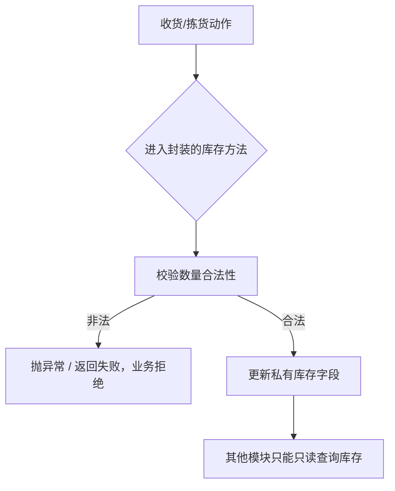
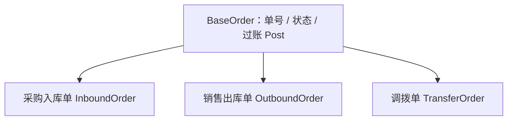
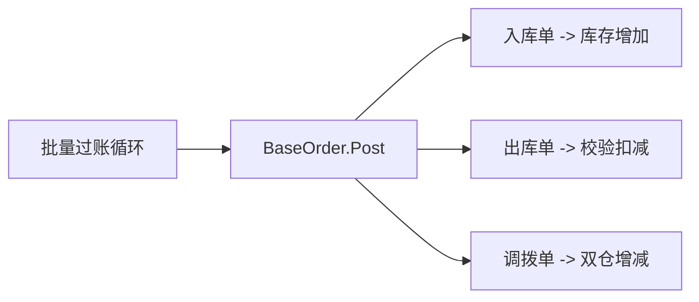

# C# 面向对象与三大特性（新手入门）

- date: 2026-08-19
- tags: [C#, OOP, 封装, 继承, 多态]
- summary: 面向零基础，用仓库管理（WMS）业务讲清什么是面向对象，以及封装、继承、多态三大特性分别解决什么问题、怎么用。

## 概述 / Overview

面向对象（Object-Oriented Programming, OOP）是一种**把现实事物抽象成"对象"**来编程的思想。

一句话先记住结论：

> **对象 = 数据（属性） + 行为（方法）**
> **封装 = 把数据和操作打包，对外只开"门"**
> **继承 = 子类复用父类，避免重复造轮子**
> **多态 = 同一句话，不同对象做不同的事**

它和"面向过程"的区别：面向过程关心"怎么一步步做"（动词 + 数据分开），面向对象关心"谁来做"（数据和动作绑定在一起）。仓库里管库存，面向过程是一堆函数 `扣库存(单号, 数量)` 到处传参；面向对象则是 `库存对象.扣减(数量)`，数据跟着对象走。

---

## 核心知识点 / Key Points

### 1. 什么是对象、类？

- **类（class）** 是模板/图纸；**对象（object）** 是按图纸造出来的实体。
- 类里有**字段/属性**（数据，如数量）和**方法**（行为，如入库、出库）。

```csharp
class Stock   // 类：图纸
{
    public int Qty { get; private set; }   // 属性：数据
    public void In(int n) => Qty += n;     // 方法：行为
}
Stock s = new();  // 对象：照图纸造出的实体
```

### 2. 封装（Encapsulation）—— 数据要"锁"起来

**核心思想：隐藏内部细节，通过公开接口访问数据，防止数据被随意改坏。**

- 字段用 `private` 私有，外部不能直接改。
- 通过公开方法（`public`）读写，方法里可以做**校验**。

```csharp
class Stock
{
    private int _qty;                       // 私有字段，外面摸不到
    public int Qty => _qty;                 // 只读对外

    public void In(int n)                   // 公开入口，带校验
    {
        if (n <= 0) throw new ArgumentException("入库数量必须大于 0");
        _qty += n;
    }
    public bool TryOut(int n)               // 出库防负数
    {
        if (n <= 0 || n > _qty) return false;
        _qty -= n;
        return true;
    }
}
// stock._qty = -100;  ❌ 编译错误：外部碰不到私有字段
```

**一句话**：封装 = "门"（公开方法）+ "锁"（私有字段），进出的数据都要过检查。

### 3. 继承（Inheritance）—— 复用与扩展

**核心思想：子类继承父类的属性和方法，形成 `is-a` 关系，公共部分只写一次。**

- 子类 `: 父类`，自动获得父类非 `private` 成员。
- 可以新增自己的成员、用 `override` 重写父类方法。
- 抽象类 `abstract` 只定义"该做什么"，具体怎么做交给子类。

```csharp
abstract class BaseOrder           // 单据基类：公共部分
{
    public string OrderNo { get; }
    public string Status { get; protected set; } = "已创建";
    protected BaseOrder(string no) => OrderNo = no;
    public abstract void Post();   // 抽象方法：每类单据过账逻辑不同
}

class InboundOrder : BaseOrder     // 入库单：自动继承单号/状态
{
    public InboundOrder(string no) : base(no) { }
    public override void Post() => Console.WriteLine("入库过账：库存增加");
}
```

**一句话**：继承 = "公共部分写在爸爸身上，儿子免费继承，还能有自己的特色"。

### 4. 多态（Polymorphism）—— 同一句话，不同表现

分两种，面试必问：

| 类型 | 名字 | 机制 | 何时确定 |
|------|------|------|----------|
| 编译时多态 | 方法重载（Overload） | 同名方法，参数个数/类型不同 | 编译期 |
| 运行时多态 | 方法重写（Override） | 父类引用调子类方法，靠 `virtual/override` | 运行期 |

```csharp
// 重载：同一动作，不同参数
class PickService
{
    public void Assign(string sku, int qty)            { /* 按库位分配 */ }
    public void Assign(string sku, int qty, string bin){ /* 指定库位分配 */ }
}

// 重写：父类引用，跑的是子类实现（运行时多态）
BaseOrder o = new OutboundOrder("SO-001");
o.Post();   // 编译期看是 BaseOrder，运行期实际执行 OutboundOrder.Post
```

**一句话**：重载是"同名不同参"编译期就定；重写是"父类指针、子类实现"运行期才定，这是多态的灵魂。

### 5. 三大特性的关系

- **封装**让对象自治安全（数据不裸奔）。
- **继承**让对象可复用（代码不重复）。
- **多态**让对象可替换（父类引用一把梭，加新类型不用改调用代码 —— 开闭原则）。

> 经典组合拳：**接口/基类定义规则（抽象）→ 子类各自实现（继承 + 重写）→ 上层只对着基类写代码（多态）**。这就是"面向接口编程"。

---

## 实际业务场景 / WMS·ERP 应用

### 场景 A：库存台账的封装（防呆校验）

库存对象不允许外部直接 `stock.Qty = -5`。收货入库、拣货出库都必须走 `In/TryOut` 方法，方法内部做校验：数量非正报错、出库超库存拒绝。业务规则集中在对象内部，改一处全系统生效。



### 场景 B：单据体系里的继承（公共部分收敛）

采购入库单、销售出库单、调拨单都有：单号、状态、创建人、过账动作。把它们抽成 `BaseOrder` 基类，各子类只写自己特有的部分（入库/出库/调拨的过账差异）。



### 场景 C：过账时的多态（统一调度）

报表、审批流、库存台账这些"上层"只认 `BaseOrder`，遍历一张单据列表 `foreach (BaseOrder o in list) o.Post()`，不用 `if` 判断单据类型。以后加新单据类型，上层代码零改动 —— 这正是多态价值。



### 一句话总结

> **数据别裸奔 → 封装（入库/出库走校验方法）**
> **单据公共部分别重复 → 继承（BaseOrder 基类）**
> **上层别写 if 分支判断单据类型 → 多态（对着基类调 Post）**

---

## 代码示例 / Code Example

可运行完整代码见同级目录 → [OOP/](./OOP/)

运行方式：`dotnet run`（见该目录 README）。

演示全部取材于 WMS 业务流程，一一对应上面的知识点：
1. 封装 → `StockItem` 私有库存字段，走 `In/TryOut` 校验，演示外部无法直接改库存
2. 继承 → `BaseOrder` 基类收拢单号/状态，`InboundOrder` / `OutboundOrder` 子类复用
3. 重载 → `PickService.Assign` 按库位/不按库位分配拣货任务
4. 重写（运行时多态）→ 单据数组统一 `Post()`，各自过账逻辑不同；加新单据不改循环

建议动手改一改：给 `BaseOrder` 加一个 `void PrintNo()` 公共方法看子类自动继承；新增一个 `TransferOrder` 子类加入数组，看循环不用改。

---

## 面试回答话术 / Interview Q&A

> 每条约 30~60 字，可直接背。先自己默答，再看答案。

**Q1：什么是面向对象？**
A：把现实事物抽象成对象，对象包含属性（数据）与方法（行为），程序是对象间协作；对比面向过程，强调数据与行为绑定、高内聚低耦合。

**Q2：封装是什么？**
A：把数据设为私有、操作绑定成方法，只暴露受控的公开接口；对外隐藏细节、内部可做校验，防止数据被随意改坏。

**Q3：继承是什么？**
A：子类复用父类非私有成员，形成 is-a 关系；公共代码只写一次，子类可扩展可重写，实现代码复用与职责分层。

**Q4：多态是什么？分哪两种？**
A：同一操作作用于不同对象产生不同行为。重载是编译时多态（同名不同参）；重写是运行时多态（父类引用调子类重写的方法）。

**Q5：重载和重写有什么区别？**
A：重载是同一类内同名不同参，编译期确定，不依赖继承；重写是父子类间方法签名相同、实现不同，靠 virtual/override，运行期确定。

**Q6：抽象类和接口的区别？**
A：抽象类可含实现、单继承，表达"是什么"；接口只含声明、可多实现，表达"能做什么"；多用接口面向抽象编程。

**Q7：多态能带来什么好处？**
A：面向基类/接口编程，上层只写一份调度代码；新增子类无需改调用方，符合开闭原则，提高扩展性与可维护性。

---

## 参考链接 / References

- [微软官方文档 - 面向对象编程](https://learn.microsoft.com/zh-cn/dotnet/csharp/fundamentals/tutorials/oop)
- [微软官方文档 - 继承](https://learn.microsoft.com/zh-cn/dotnet/csharp/fundamentals/object-oriented/inheritance)
- [微软官方文档 - 多态性](https://learn.microsoft.com/zh-cn/dotnet/csharp/fundamentals/object-oriented/polymorphism)

---

## 踩坑记录 / Troubleshooting

| 现象 | 原因 | 解决办法 |
|------|------|----------|
| 子类想继承但拿不到父类私有字段 | `private` 只对本类可见 | 改用 `protected`（子类可见）或提供受保护方法 |
| 字段被外部随意改成负数库存 | 属性/字段直接 `public` 裸奔 | 私有字段 + 公开方法做校验（封装） |
| `override` 报"找不到可重写方法" | 父类方法没标 `virtual/abstract` | 父类方法加 `virtual` 或用 `abstract` |
| 重写时想调父类逻辑结果递归死循环 | 在 `override` 里又调了自己 | 用 `base.方法()` 显式调用父类实现 |
| 循环里 `if` 判断单据类型写出一大堆分支 | 没有用多态 | 抽出基类/接口，统一调用 `Post()` |