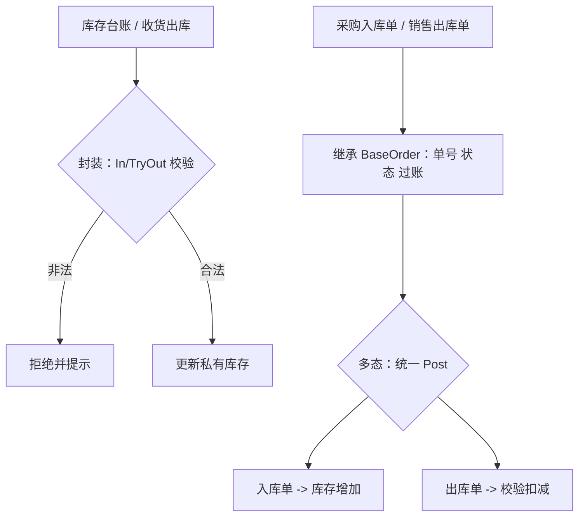

# OOP 演示项目

配套笔记：《C# 面向对象与三大特性（新手入门）》 → 返回 [../OOP.md](../OOP.md)

## 依赖环境

- .NET SDK 10 或更高（`dotnet --version` 查看）

## 运行

```bash
dotnet run
```

## 业务流程总览



## 演示内容（对应笔记知识点）

| 演示 | WMS 业务场景 | 对应知识点 |
|------|-------------|-----------|
| 1 | 库存台账入库/出库防呆校验 | 封装（私有字段 + 校验方法） |
| 2 | 入库单/出库单共用单号、状态 | 继承（BaseOrder 基类复用） |
| 3 | 拣货任务按库位/不按库位分配 | 重载（编译时多态） |
| 4 | 单据数组统一过账，各走各的逻辑 | 重写（运行时多态） |

## 建议动手改

- 把 `StockItem.Qty` 的 setter 改成 `public` 试着重赋库存，体会裸奔危害
- 新增一个 `TransferOrder`（调拨单）子类放进 `orders` 数组，循环不用改
- 给 `BaseOrder` 加公共字段（如创建人）看子类是否自动继承
- 把 `PrintNo()` 改 `virtual`，在入库单里 `override` 加前缀，看重写效果