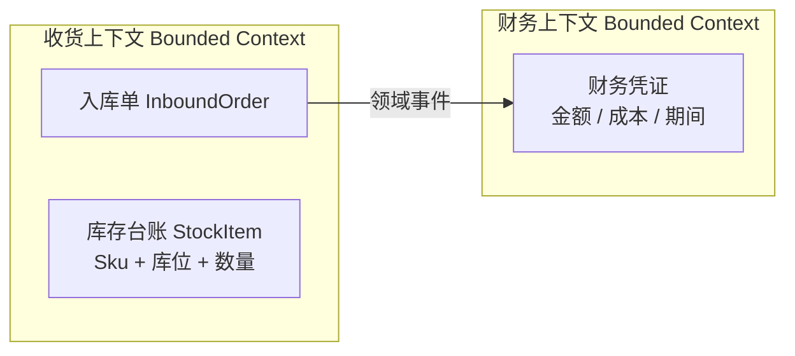
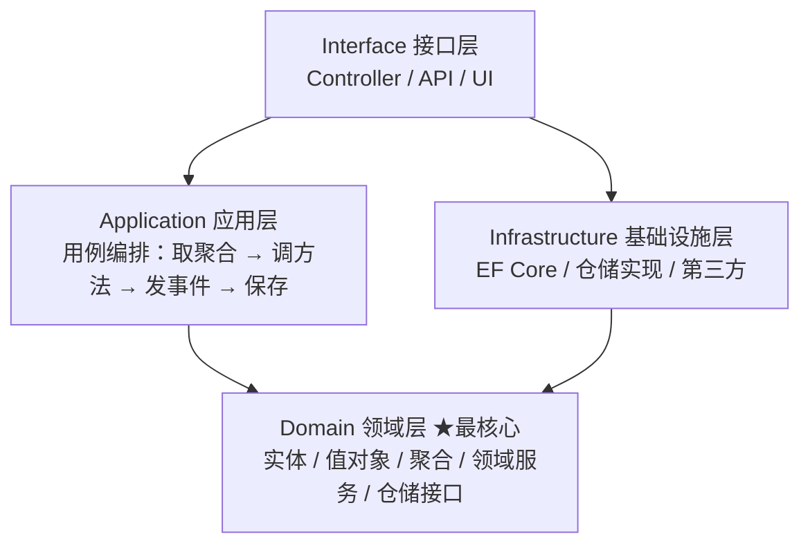
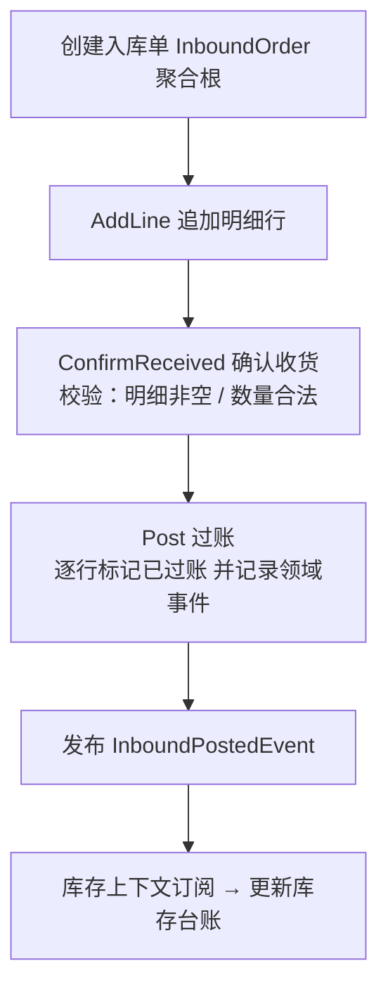
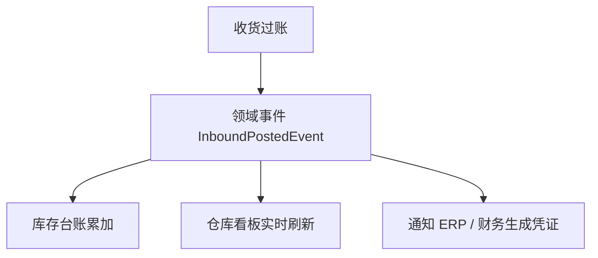

# 领域驱动设计 DDD（新手入门 + 面试速成）

- date: 2026-08-19
- tags: [DDD, 领域驱动设计, 架构, 分层, 面试]
- summary: 面向初级开发，用 WMS 收货入库业务讲清 DDD 是什么、解决什么问题，以及实体/值对象/聚合/领域事件/限界上下文等核心概念，附可直接背的面试话术。

## 概述 / Overview

DDD（Domain-Driven Design，领域驱动设计）是一套**"从业务出发"**的软件设计思想：先把业务规则吃透，让代码结构和业务模型一一对应，而不是先设计数据库表再往上套代码。

一句话先记住结论：

> **传统做法：先有表，再写 Service 里的 if/else → 业务规则散落各处，改一处漏一处**
> **DDD 做法：先建领域模型（业务规则放在对象内部），代码"长在业务上"，表只是落地的仓库**

DDD 分两块：
- **战略设计**：先把系统切成几个独立"上下文"，各自用统一的业务语言（回答：怎么分、怎么协作）
- **战术设计**：在上下文中具体建模（实体、值对象、聚合、领域服务、仓储、领域事件）（回答：代码怎么写）

---

## 核心知识点 / Key Points

### 1. 为什么需要 DDD？—— 贫血模型的痛点

传统三层架构 Controller → Service → Repository，最常见的写法是：

```csharp
// 传统写法：实体只是个"数据袋子"（贫血模型）
class InboundOrder
{
    public string OrderNo { get; set; }
    public string Status { get; set; }          // 谁都能改
    public List<InboundLine> Lines { get; set; }
}

class InboundService
{
    public void Confirm(InboundOrder o)          // 业务规则全在 Service 里
    {
        if (o.Lines.Count == 0) throw new Exception("没有明细");
        o.Status = "Received";                    // 直接改公共属性
    }
}
```

问题：实体没有任何行为，规则全堆在 Service。业务一旦复杂（校验、状态流转、边界处理），Service 越来越臃肿，同一套规则被 Copy 到多个方法里，改一个忘了另一个。

**DDD 的答案**：把规则塞回对象内部（充血模型），让对象自己管好自己的状态。

### 2. 战略设计 vs 战术设计

| | 战略设计 | 战术设计 |
|---|---|---|
| 回答的问题 | 系统怎么划分、上下文之间怎么协作 | 上下文内部代码怎么写 |
| 主要工具 | 限界上下文、通用语言、上下文映射 | 实体、值对象、聚合、领域服务、仓储、领域事件 |
| 粒度 | 大（跨模块/跨系统） | 小（一个模块内部） |

初级面试常问的主要是**战术设计**那套名词，但两个方向都要能说上话。

### 3. 通用语言（Ubiquitous Language）

业务人员和开发人员用**同一套术语**，并且直接体现到代码的类名、方法名里。

例：仓库业务说"收货""上架""拣货""盘点"，代码里类就叫 `InboundOrder`、方法就叫 `ConfirmReceived()`，不要让业务说"入库单"、代码里却是 `ReceiveBill`。减少翻译，减少歧义。

### 4. 限界上下文（Bounded Context）

同一个词在不同业务场景里含义不同。比如"库存"：

- **收货上下文**：库存 = 按 `Sku + 库位` 的可用数量
- **财务上下文**：库存 = 需要盘点的金额、成本

两个上下文对"库存"的模型、数据库、代码应该是**各自独立**的，不该共用一套实体。限界上下文就是给模型划一条清晰的边界，边界内自洽，边界外通过接口/事件协作。



### 5. 战术设计核心构件

以下六个名词是 DDD 面试的"全家桶"，逐个记：

| 构件 | 一句话 | 例子 |
|---|---|---|
| 实体 Entity | **有唯一标识**（ID），属性可变，生命周期会变化 | 库存台账行（按 Sku+库位区分）、单据 |
| 值对象 Value Object | **没有标识**，靠属性值本身区分，**不可变** | 数量 Quantity、库位 BinCode、地址 |
| 聚合 Aggregate | 一组必须**保持一致**的对象整体，内部先保一致再落库 | 单据 + 明细 + 状态 |
| 聚合根 Aggregate Root | 聚合的**唯一对外入口**，外部只能通过它操作 | InboundOrder |
| 领域服务 Domain Service | 跨多个对象的规则，塞不进单个实体时用 | 分配拣货任务 |
| 仓储 Repository | 领域侧定义的**存取聚合的接口**，屏蔽底层数据库 | IInboundOrderRepository |

```csharp
// 值对象：record 天然不可变，构造时校验
public sealed record Quantity(int Value)
{
    public Quantity(int value) : this(value)
    {
        if (value <= 0) throw new ArgumentException("数量必须大于 0");
    }
}
```

**为什么值对象要不可变？** 因为值对象没有身份，改一个值等于换了另一个对象，可变反而容易产生共享引用互相污染的问题。

### 6. 贫血模型 vs 充血模型

| | 贫血模型 | 充血模型 |
|---|---|---|
| 实体里有什么 | 只有 get/set 属性 | 属性 + 业务规则方法 |
| 业务规则在哪 | Service 里堆 if/else | 实体/聚合根内部 |
| 本质 | 数据袋子，面向过程的"壳" | 数据和行为绑定，真面向对象 |
| DDD 主张 | ❌ | ✅ |

判断小技巧：看 `Status` 能不能在外面被直接赋值。能——贫血；不能，只能通过 `ConfirmReceived()` 之类的方法变——充血。

### 7. DDD 分层架构

经典四层，**依赖方向由外向内，内层不依赖外层（依赖倒置）**：



- **Domain 层**：最干净，只依赖自己的业务规则，不引用 EF Core、不用数据库类型。
- **Application 层**：不做业务判断，只负责"把一个用例的流程串起来"。
- **Infrastructure 层**：把仓储接口、消息、外部系统接口落地实现。
- **Interface 层**：对外暴露，用 DI 组装各层。

### 8. 什么时候该用 DDD？

- **该用**：业务复杂、规则多、状态流转多、会持续变化、需要业务方深度参与（WMS、ERP、金融核心）。
- **不该用**：简单 CRUD 管理后台、报表查询类系统。硬套 DDD 属于**过度设计**，反而增加成本。

---

## 实际业务场景 / WMS·ERP 应用

### 场景 A：收货入库聚合根（战术设计）

把"单据 + 明细 + 状态"打包成一个聚合，外部要收货、过账只能调聚合根方法，规则在内部统一校验：



对应的代码骨架（完整可运行代码见同级目录）：

```csharp
public class InboundOrder
{
    public string OrderNo { get; }
    public InboundStatus Status { get; private set; }
    public IReadOnlyList<InboundLine> Lines { get; }
    public IReadOnlyList<InboundPostedEvent> DomainEvents { get; }

    public void AddLine(int lineNo, string sku, Quantity qty, string binCode)
    {
        if (Status != InboundStatus.Created) throw new InvalidOperationException("单据已收货，不能再加行");
        // ...
    }
    public void Post()
    {
        if (Status != InboundStatus.Received) throw new InvalidOperationException("只有已收货单据才能过账");
        // 逐行过账 + 记录领域事件
    }
}
```

### 场景 B：库存变动领域事件（上下文解耦）

收货过账后，"库存台账更新、看板刷新、通知 ERP"都属于**别的上下文**的事，收货上下文不该知道有谁在听，只管发出事件：



### 场景 C：限界上下文划分（战略设计）

WMS 里"库存"不是同一个东西：收货上下文关心数量、财务上下文关心金额。两个上下文各自建模、各自落库，通过领域事件协作，避免一套实体被两套规则拉扯。

### 一句话总结

> **业务规则放回对象里（充血）→ 聚合根管单据一致性 → 跨上下文用领域事件通知 → 领域层不依赖任何技术**

---

## 代码示例 / Code Example

可运行完整代码见同级目录 → [DDD/](./DDD/)

运行方式：`dotnet run`（见该目录 README）。

演示一条完整收货入库流程（全部取材 WMS 业务，一一对应上面的知识点）：
1. 值对象 `Quantity` → record 不可变，构造校验数量 > 0
2. 实体 `StockItem` → 有身份（Sku+库位）、库存可变，增减走 `In/TryOut` 校验
3. 聚合根 `InboundOrder` → 加行/确认收货/过账规则全部内部封装，外部只读
4. 领域事件 `InboundPostedEvent` → 过账后由应用层发布，库存台账订阅响应
5. 仓储接口（领域层）→ 内存实现（基础设施层），依赖倒置
6. 应用层 `InboundAppService` → 只编排：取聚合 → 调聚合根方法 → 发事件 → 保存
7. 规则拦截演示 → 已过账的单据再 `AddLine` 会被聚合根抛异常拦下

建议动手改一改：把 `StockItem` 改成一个独立的"库存上下文"类库，或在 `ConfirmAndPost` 里故意不先 `ConfirmReceived` 直接 `Post`，看聚合根怎么拦。

---

## 面试回答话术 / Interview Q&A

> 每条约 30~60 字，可直接背。先自己默答，再看答案。

**Q1：什么是 DDD？**
A：领域驱动设计，从业务领域出发建模的软件设计方法论：先理清业务规则，用通用语言把领域模型映射成代码，让代码长在业务上，而不是从数据库表出发。

**Q2：贫血模型和充血模型有什么区别？**
A：贫血模型实体只装 get/set 数据、规则全在 Service（本质面向过程）；充血模型把属性和业务规则封装进领域对象，Service 只做编排，规则内聚在对象里。

**Q3：实体和值对象的区别？**
A：实体有唯一标识、属性可变、有生命周期，靠 ID 区分；值对象无标识、靠属性值相等、创建后不可变，如数量、库位。实体管"身份"，值对象管"值"。

**Q4：什么是聚合和聚合根？为什么需要？**
A：聚合是一组必须保持一致的对象整体（如单据+明细+状态）；聚合根是唯一对外入口，外部只能通过它操作成员，保证内部规则与事务边界。

**Q5：什么是领域服务和仓储？**
A：领域服务承载跨多个对象的业务规则，塞不进单个实体时用；仓储是领域侧定义的存取聚合的接口，把底层数据库抽象掉，实现依赖倒置。

**Q6：什么是限界上下文和通用语言？**
A：限界上下文是模型的边界，同一词在不同上下文含义不同、各自独立建模；通用语言是业务与开发共用的术语，直接体现在类名方法名，减少歧义。

**Q7：什么是领域事件？有什么作用？**
A：领域里发生并值得通知下游的事实，如"入库已过账"；聚合内部记录事件、应用层发布，下游各自响应，实现上下文之间解耦。

**Q8：DDD 分哪几层？依赖方向？**
A：Interface → Application → Domain → Infrastructure；依赖由外向内，领域层最核心、不依赖任何技术，基础设施层实现领域层定义的仓储接口（依赖倒置）。

**Q9：什么时候该用 DDD？**
A：业务复杂、规则多、变化频繁、需要业务方深度协作时值得用；简单 CRUD/报表系统硬套 DDD 是过度设计，成本高于收益。

**Q10：DDD 有什么缺点？**
A：学习曲线陡、建模成本高、聚合事务边界与最终一致性难把握；团队不懂业务或场景简单时容易"为了 DDD 而 DDD"，只剩分层没有建模。

---

## 参考链接 / References

- [微软官方文档 - 使用 DDD 和 CQRS 设计微服务](https://learn.microsoft.com/zh-cn/dotnet/architecture/microservices/microservice-ddd-cqrs-patterns/)
- [Martin Fowler - AnemicDomainModel（贫血领域模型）](https://martinfowler.com/bliki/AnemicDomainModel.html)
- Eric Evans《领域驱动设计：软件核心复杂性应对之道》（DDD 原书）
- [微软官方文档 - 值对象](https://learn.microsoft.com/zh-cn/dotnet/architecture/microservices/microservice-ddd-cqrs-patterns/implement-value-objects)

---

## 踩坑记录 / Troubleshooting

| 现象 | 原因 | 解决办法 |
|------|------|----------|
| 说用了 DDD，其实只在 Service 里堆 if/else | 只有分层没有领域建模，规则没下沉 | 把规则收进实体/聚合根方法，Service 只编排 |
| 直接 new 子实体、绕过聚合根改明细 | 聚合边界没守住 | 子实体成员只读，一切改动走聚合根方法 |
| 数量/库位这种"值"做成了实体 | 没分清身份与值 | 无 ID、值不可变的用 record 值对象 |
| 领域层直接引用 EF Core / DbContext | 依赖方向反了 | Domain 只定义仓储接口，实现放 Infrastructure，DI 注入 |
| 值对象写成可变类，被到处改 | 违反了不可变约定 | 用 `record` 或只读字段，构造时校验 |
| 简单 CRUD 后台也硬套 DDD | 过度设计 | 先评估业务复杂度，简单系统用传统分层 |
| 跨聚合强一致做不到就堆一个大聚合 | 想用一个聚合解决所有问题 | 拆小聚合 + 领域事件 + 最终一致性 |