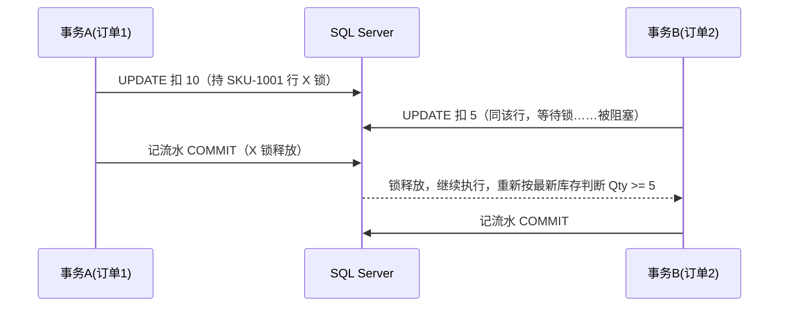

# SQL Server 事务与隔离级别（新手入门）

- date: 2026-08-19
- tags: [SQL Server, 事务, 隔离级别, 锁, WMS, 库存]
- summary: 事务的 ACID 是什么；SQL Server 五种隔离级别各自解决什么并发问题；隔离级别和锁是两个不同维度；以及 WMS 库存扣减为什么用"事务 + 行锁 + 条件更新"防超卖。

## 概述 / Overview

> 一句话先说结论：
> **事务把一批操作绑成"要么全成、要么全不成"；隔离级别决定"读的人看到什么"，锁决定"写的人如何互斥"。扣库存这种"写写竞争"场景，靠默认隔离级别 + 行锁（排它锁）就够了，不需要上重的隔离级别。**

想象一下仓库的账本：

1. **账本（数据库）**：全仓共用一本库存账。
2. **记账员（事务）**：记账员记库存时必须"一本帐记到底"——入库单写了 10 件，库存、流水、单据状态三处必须一起改，改到一半停电了就得整笔回滚，绝不允许"库存加了但流水没记"。
3. **两个人同时改同一行（锁）**：两个拣货员同时想扣 SKU-1001 的库存，账本上必须排队，后到的人等先到的人落笔（提交）再动，否则就会把账算错。
4. **读账本的人（隔离级别）**：一个盘点员正在一边读库存一边报数，如果另一个记账员还没落笔就被他看到，就会读到"假账"。隔离级别就是规定"盘点员到底能读到哪一步的账"。

下面逐步展开。

---

## 核心知识点 / Key Points

### 1. 事务与 ACID

事务（Transaction）把一批 SQL 操作打包成一个不可分割的整体。标准事务具备四大特性 **ACID**：

| 特性 | 含义 | 库存场景举例 |
|------|------|--------------|
| 原子性 Atomicity | 要么全部成功，要么全部回滚 | 扣库存+记流水+更单据状态，一起提交或一起回滚 |
| 一致性 Consistency | 事务前后数据都满足约束 | 库存不允许为负；扣 10 件后总量恰好少 10 |
| 隔离性 Isolation | 并发事务互不干扰 | 两个并发扣减互不读到对方的中间状态 |
| 持久性 Durability | 提交后数据不会丢失 | 提交即落盘，断电不丢 |

```sql
BEGIN TRAN;
    UPDATE Inventory SET Qty = Qty - 10 WHERE SkuId = 'SKU-1001';
    INSERT INTO InventoryFlow(SkuId, Qty, BizType) VALUES ('SKU-1001', -10, 'OUTBOUND');
COMMIT;
-- 任一句出错 -> ROLLBACK，两个改动全部撤销
```

### 2. 先分清两个维度：隔离级别 vs 锁

面试里最容易混淆的一点：

- **隔离级别 = 规定"读"的可见范围**（读语句加什么锁、锁多久、能不能读到未提交数据）。它是事务级的设置。
- **锁 = 规定"写"如何互斥**（同一行同一时刻只能有一个排它锁），由 SQL Server 在执行 DML 时自动加，事务提交/回滚才释放。

> 扣库存是典型的"写写竞争"，核心靠**锁**保证，而不是提高隔离级别。

### 3. SQL Server 的五种隔离级别

默认隔离级别是 **READ COMMITTED（读已提交）**。隔离级别从低到高（并发越来越差、一致性越来越强）：

| 隔离级别 | 脏读 | 不可重复读 | 幻读 | 实现方式 |
|----------|:----:|:----:|:----:|----------|
| READ UNCOMMITTED | 可能 | 可能 | 可能 | 读不加共享锁（≈ NOLOCK） |
| READ COMMITTED（默认） | 避免 | 可能 | 可能 | 读加 S 锁，语句结束立即释放 |
| REPEATABLE READ | 避免 | 避免 | 可能 | S 锁保持到事务结束 |
| SNAPSHOT | 避免 | 避免 | 避免 | 行版本控制，读不阻塞写 |
| SERIALIZABLE | 避免 | 避免 | 避免 | 加范围锁，写也会被阻塞 |

三种并发问题的定义：

- **脏读**：读到其他事务**未提交**的数据，别人回滚后你读到的是假数据。
- **不可重复读**：同一事务内读同一行两次，第二次读到别的事务**已提交**的修改，两次结果不一样。
- **幻读**：同一事务内执行同一查询两次，结果集的**行数**变了（别的事务插入/删除了满足条件的行）。

切换隔离级别：

```sql
SET TRANSACTION ISOLATION LEVEL READ COMMITTED;   -- 当前会话生效
```

> 提示：`READ COMMITTED` 下 `SELECT` 的 S 锁"读完即放"，是很多面试官考察的细节；提高到 `REPEATABLE READ` 后锁会一直持有到事务结束。

### 4. 锁与并发问题

SQL Server 的锁核心是两种：

- **共享锁 S（Shared）**：`SELECT` 默认加。读与读兼容，多个 S 锁共存。
- **排它锁 X（Exclusive）**：`UPDATE / INSERT / DELETE` 自动加。X 与 S、X 与 X 都互斥——一旦某个事务持有一行的 X 锁，其他事务读它要等、写它要等，直到提交或回滚。

锁的粒度从细到粗：**行（键）→ 页 → 表**。SQL Server 默认优先行锁，锁数量超过阈值（约 5000 个）会自动升级到表锁。

常用锁提示（写在 `WITH (...)` 里）：

| 提示 | 作用 |
|------|------|
| `WITH (ROWLOCK)` | 明确用行锁，降低锁粒度 |
| `WITH (UPDLOCK)` | SELECT 时就直接加更新锁，防止后续 UPDATE 时被别人抢走 |
| `WITH (XLOCK)` | SELECT 时直接加排它锁 |
| `WITH (HOLDLOCK)` | 锁保持到事务结束（等价 REPEATABLE READ 的锁行为） |
| `WITH (TABLOCKX)` | 直接锁整张表 |
| `WITH (NOLOCK)` | 读不加锁（等价 READ UNCOMMITTED，可能脏读） |

死锁：两个事务各自持有对方的锁不释放，互相等待。SQL Server 会检测死锁并**自动选择牺牲者回滚其中一个**（抛出 1205 错误），应用程序应捕获并重试。

### 5. WMS 库存扣减实战（事务 + 行锁 + 条件更新）

库存扣减（出库/拣货过账）是 WMS 里最典型的并发写场景：多个订单可能同时扣同一个 SKU。正确做法：

```sql
BEGIN TRAN;
    -- 关键点：WHERE 里带 Qty >= @qty，条件更新天然防超卖
    UPDATE Inventory
       SET Qty = Qty - @qty
     WHERE SkuId = @skuId
       AND Qty >= @qty;

    IF @@ROWCOUNT = 0          -- 库存不足，一条都没更新
        ROLLBACK;
    ELSE
    BEGIN
        INSERT INTO InventoryFlow(...) VALUES (...);
        COMMIT;
    END;
```

并发时序（两个订单同时扣 SKU-1001）：



要点总结：

- `UPDATE` 一旦命中行就自动持有该行 **X 锁直到提交**，后面的并发扣减自动排队，这就是"事务 + 行锁"的含义，**不需要换隔离级别**，默认 `READ COMMITTED` 即可。
- **防超卖靠的是 WHERE 条件 + 判断影响行数**，而不是隔离级别；即使两个请求并发，第二个在等待期间第一个已提交，它看到的是最新库存。
- 隔离级别在库存场景真正的用武之地是"**先查后改**"的读一致性，比如"先 SELECT 锁定记录再操作"可用 `UPDLOCK`，或盘点类"全程读到同一版本"可用快照隔离。

### 6. 快照隔离 / READ_COMMITTED_SNAPSHOT

SQL Server 还提供基于**行版本控制**的乐观隔离，读不加锁、读不阻塞写：

```sql
-- 开启数据库选项
ALTER DATABASE MyWms SET ALLOW_SNAPSHOT_ISOLATION ON;
-- 会话级启用快照隔离
SET TRANSACTION ISOLATION LEVEL SNAPSHOT;
```

- `SNAPSHOT`：事务读到**开始那一刻**的版本快照，天然杜绝脏读/不可重复读/幻读，且读不阻塞写。
- `READ_COMMITTED_SNAPSHOT ON`：把默认的 `READ COMMITTED` 从"锁读"改为"版本读"，每条语句读到语句开始时的快照，应用完全无感。
- 代价：`tempdb` 行版本存储开销，写冲突时后提交者报 3960 错误。

---

## 代码示例 / Code Example

可运行示例见 [./TransactionIsolation/sql/demo.sql](./TransactionIsolation/sql/demo.sql)，运行说明见 [./TransactionIsolation/README.md](./TransactionIsolation/README.md)。

---

## 面试回答话术 / Interview Q&A

> 每条约 30~60 字，可直接背。先自己默答，再看答案。

**Q1：SQL Server 有哪些事务隔离级别？默认是哪个？**
A：共五种：读未提交、读已提交、可重复读、快照、可串行化；默认是读已提交，避免脏读但可能有不可重复读和幻读。

**Q2：脏读、不可重复读、幻读分别是什么？**
A：脏读读到未提交数据；不可重复读是同一事务两次读同行结果不一致；幻读是同一事务两次查询行数变化，分别被读已提交、可重复读、可串行化解决。

**Q3：隔离级别和锁是一回事吗？**
A：不是。隔离级别规定读的可见范围，锁规定写如何互斥；写写竞争靠行锁，读一致性才看隔离级别，两者不同维度。

**Q4：WMS 扣库存怎么防超卖？**
A：事务内 UPDATE 用 WHERE 库存>=扣减量做条件更新，SQL Server 自动对该行加排它锁直到提交，并发请求排队，影响行数为 0 则回滚。

**Q5：扣库存需要把隔离级别调高吗？**
A：不需要。扣库存是写写竞争，默认读已提交加行锁即可；调高到串行化反而用范围锁放大锁粒度，并发和性能都变差。

**Q6：SELECT 会加锁吗？读已提交下锁什么时候释放？**
A：会加共享锁，读读兼容不阻塞；读已提交下语句结束立即释放，所以同一事务两次读可能结果不同，即不可重复读。

**Q7：死锁怎么办？**
A：SQL Server 自动检测死锁并回滚牺牲者抛 1205；应用层重试事务即可，避免长事务和锁顺序不一致可减少死锁。

**Q8：快照隔离和可串行化都能避免幻读，区别是什么？**
A：快照用行版本，读不阻塞写、写不阻塞读，并发高但依赖 tempdb；可串行化靠范围锁硬锁，写会被阻塞，并发最差。

---

## 参考链接 / References

- [微软官方文档 - 事务隔离级别](https://learn.microsoft.com/zh-cn/sql/t-sql/statements/set-transaction-isolation-level-transact-sql)
- [微软官方文档 - 锁与行版本控制](https://learn.microsoft.com/zh-cn/sql/relational-databases/sql-server-transaction-locking-and-row-versioning-guide)
- [微软官方文档 - 死锁](https://learn.microsoft.com/zh-cn/sql/relational-databases/sql-server-deadlocks-guide)

---

## 踩坑记录 / Troubleshooting

| 现象 | 原因 | 解决办法 |
|------|------|----------|
| 并发扣库存库存变负 | UPDATE 没带 `Qty >= 扣减量` 条件 | WHERE 里加库存下限判断，影响行数为 0 则回滚 |
| 某个查询堵住其他所有操作 | 长事务持锁不提交 | 事务里只放必要操作，尽快 COMMIT；查 `sys.dm_exec_requests` 定位阻塞 |
| 报表查询慢且频繁阻塞写入 | 长 SELECT 持 S 锁 | 开启 `READ_COMMITTED_SNAPSHOT` 用版本读，读不阻塞写 |
| 高并发大量行更新时变表锁 | 锁升级到表级 | 控制单事务更新行数（如分批），或加 `ROWLOCK` 提示降低升级概率 |
| 报错 1205（死锁） | 两个事务锁顺序互相等待 | 统一加锁顺序、缩短事务，应用层捕获后重试 |
| 报错 3960（快照写冲突） | 快照隔离下并发写同一行 | 捕获后重试事务，或对热点行改用 `UPDLOCK` 先锁定再改 |
