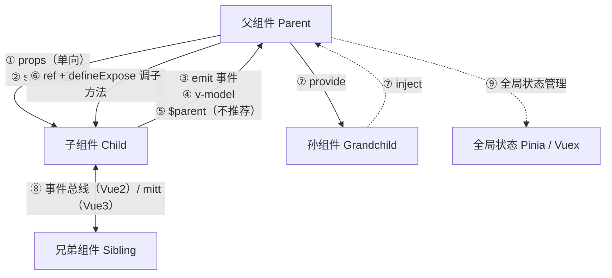

# Vue 父子组件传值（Vue 2 vs Vue 3）

- date: 2026-08-13
- tags: [Vue, 组件通信, props, emit, v-model, provide, inject, defineExpose]
- summary: 面试被追问"除了 props 还有什么传值方式"时的完整答案：按"父→子 / 子→父 / 跨层级 / 全局"四个方向梳理 props、emit、v-model、ref+defineExpose、$parent/$children、provide/inject、事件总线，Vue 2 与 Vue 3 写法对照，附可运行示例。

## 概述 / Overview

> 一句话先说结论：
> **父子传值就一句话——父往子传靠 `props`，子往父传靠 `emit`（自定义事件），双向绑定是两者合体的语法糖 `v-model`；想要"跳过中间层"或"非父子"通信，还有 provide/inject、事件总线（Vue 3 里用 mitt 或 Pinia 代替）。** 面试只答 `props` 太单薄，加分项是"按方向分类 + 各举一例 + 说清 Vue 2/3 差异"。

把组件通信想成 WMS 仓库里的单据流转：

- **父 → 子**：主管（父）给扫码员（子）下任务单，扫码员只读任务，改不了任务单——`props`，单向数据流。
- **子 → 父**：扫码员扫完货，喊一嗓子"这批 SKU-1001 扫完 120 件"上报给主管——`$emit` 自定义事件。
- **双向**：主管和扫码员对着同一块白板写字（共享一个"当前 SKU"）——`v-model`。
- **跨层级**：集团总部（祖父）直接把"仓库统一编码规范"下发给基层（孙），中间层不需要碰——`provide/inject`。
- **全局/旁路**：多个互不相干的人用"广播站"喊话——事件总线（Vue 2）/ mitt、Pinia（Vue 3）。



- **方向**：`props`/`slot`/`ref` 是父对子；`emit`/`v-model`/`$parent` 是子对父；`provide/inject` 是祖先对后代；事件总线与 Pinia 是不限层级的"旁路"。
- **原则**：能用 `props + emit` 的尽量别用 `$parent`/事件总线——前者显式、可复用，后者隐式耦合、难维护。

---

## 核心知识点 / Key Points

### 0. 总览：Vue 2 / Vue 3 传值方式对照表

| 方式 | 方向 | Vue 2 写法 | Vue 3 写法 | 备注 |
|------|------|-----------|-----------|------|
| **props** | 父 → 子 | `props: ['orderNo']` | `defineProps(['orderNo'])` | 两者一样，单向数据流 |
| **自定义事件** | 子 → 父 | `this.$emit('scan', data)` | `defineEmits(['scan'])` + `emit('scan', data)` | Vue 3 声明更严格 |
| **v-model** | 双向 | 单个 `value`+`$emit('input')`；`.sync` | 可多个 `v-model:xxx`；`defineModel()` | Vue 3 语法糖升级 |
| **ref 拿子实例** | 父 → 子 | `this.$refs.child.xxx`（全量暴露） | `ref` + 子组件 `defineExpose` | script setup 默认"关门" |
| **$parent / $children** | 子↔父 | 都有 | **$children 移除**，$parent 保留 | 不推荐，耦合强 |
| **provide / inject** | 祖先 → 后代 | `provide(){...}` / `inject:['xxx']` | `provide()` / `inject()` | 跨层级免逐层透传 |
| **事件总线** | 任意 | `new Vue()` + `$on/$emit/$off` | **已移除** → mitt / Pinia | Vue 3 官方建议不用全局总线 |
| **$attrs / $listeners** | 父 → 子 | 两个分开 | **$listeners 合并进 $attrs** | 透传属性/事件 |
| **slot（插槽）** | 父 → 子 | `slot` / `scope` 插槽 | `slot` / 具名插槽 / 作用域插槽 | 父传模板内容 |
| **全局状态** | 任意 | Vuex | Pinia（Vuex 3 也兼容） | 复杂共享数据用 |

---

### 1. 父 → 子：props（最常用，先答这个）

**Vue 3（script setup）：**

```vue
<!-- App.vue 父组件 -->
<script setup>
import ScannerInput from './ScannerInput.vue'
const orderNo = 'PO-2026-0813'
</script>
<template>
  <ScannerInput :order-no="orderNo" />
</template>
```

```vue
<!-- ScannerInput.vue 子组件 -->
<script setup>
const props = defineProps({
  orderNo: { type: String, required: true },
})
</script>
<template>
  单据号：{{ orderNo }}   <!-- 模板里可直接用，不用 props. 前缀 -->
</template>
```

**Vue 2 子组件：** `props: { orderNo: { type: String, required: true } }`，模板里 `{{ orderNo }}`，脚本里 `this.orderNo`。

要点：

- **单向数据流**：子组件**不能**直接改 props（Vue 会警告）。要改就 `emit` 让父组件改，或复制到子组件自己的 data 里。
- 模板属性用 **kebab-case**（`order-no`），props 声明用 **camelCase**（`orderNo`），Vue 自动对应。

### 2. 子 → 父：自定义事件 emit

**Vue 3：**

```vue
<!-- ScannerInput.vue -->
<script setup>
const emit = defineEmits(['scan'])
function submit() {
  emit('scan', 'SKU-1001')   // 上报给父组件
}
</script>
```

```vue
<!-- App.vue 父组件 -->
<template>
  <ScannerInput @scan="onScan" />
</template>
<script setup>
function onScan(barcode) { /* 收到子组件上报的条码 */ }
</script>
```

**Vue 2：** 子组件 `this.$emit('scan', 'SKU-1001')`，父组件 `@scan="onScan"`。

要点：

- `defineEmits` 声明事件后，把 `emit` 当作函数用；Vue 2 直接用 `this.$emit`。
- 事件名推荐 camelCase（`scan`、`update:sku`）；模板里监听用 `@scan`。

### 3. 双向绑定：v-model（props + emit 的语法糖）

**核心本质**：`v-model="currentSku"` 等价于 `:model-value="currentSku"` + `@update:model-value="currentSku = $event"`。

**Vue 3（推荐用 defineModel，3.4+ 稳定）：**

```vue
<!-- ScannerInput.vue -->
<script setup>
const inputValue = defineModel({ type: String, default: '' })
</script>
<template>
  <input v-model="inputValue" />
</template>
```

```vue
<!-- App.vue -->
<template>
  <ScannerInput v-model="currentSku" />   <!-- 双向绑定 -->
</template>
```

不用 `defineModel` 的等价写法（新旧都要会）：

```vue
<script setup>
const props = defineProps(['modelValue'])
const emit = defineEmits(['update:modelValue'])
</script>
<template>
  <input :value="props.modelValue"
         @input="emit('update:modelValue', $event.target.value)" />
</template>
```

**Vue 3 独有：多个 v-model**（Vue 2 只能一个默认的）：

```vue
<!-- 父：两个 v-model 各绑各的 prop -->
<ScannerInput v-model="sku" v-model:qty="qty" />
<!-- 子：defineModel('sku') 对应 v-model，defineModel('qty') 对应 v-model:qty -->
<script setup>
const sku = defineModel('sku')
const qty = defineModel('qty')
</script>
```

**Vue 2 写法：**

```js
// 子组件：接收 value prop，改动时 $emit('input')
props: ['value'],
methods: { clear() { this.$emit('input', '') } }
// 除默认 v-model 外的其他 prop 用 .sync（update:propName）
// 父：<Comp :title="t" @update:title="t = $event" /> 简写为 <Comp :title.sync="t" />
```

### 4. 父调子：ref + defineExpose（Vue 3 关键差异）

父组件想直接调用子组件的方法/属性时用模板 `ref`。

**Vue 2：**

```js
// 父：<ScannerInput ref="scanner" />
this.$refs.scanner.clearInput()   // 子实例全量暴露，随便调
```

**Vue 3：** `<script setup>` 组件默认"关门"，必须 `defineExpose` 显式暴露，父组件才拿得到：

```vue
<!-- ScannerInput.vue -->
<script setup>
function clearInput() { /* ... */ }
defineExpose({ clearInput })   // 只暴露这一个
</script>
```

```vue
<!-- App.vue -->
<script setup>
import { ref } from 'vue'
const scannerRef = ref(null)
function clear() { scannerRef.value?.clearInput() }
</script>
<template>
  <ScannerInput ref="scannerRef" />
</template>
```

要点：**Vue 3 里不给 `defineExpose`，父组件 `ref.value` 上什么都没有**——这是 Vue 2 迁移 Vue 3 最常见的坑之一。

### 5. 跨层级：provide / inject（祖 → 孙，跳过中间层）

组件树很深时，逐层传 props 太啰嗦（prop 逐层透传 / prop drilling），用 provide/inject 让"祖父直接给孙子"。

**Vue 3：**

```vue
<!-- 祖父组件 App.vue -->
<script setup>
import { reactive, provide } from 'vue'
const warehouse = reactive({ code: 'WH-01', name: '华东一号库' })
provide('warehouse', warehouse)   // 传给整棵子树
</script>
```

```vue
<!-- 孙组件 WarehouseBadge.vue（中间层不需要碰） -->
<script setup>
import { inject } from 'vue'
const warehouse = inject('warehouse')
</script>
<template>{{ warehouse.code }} {{ warehouse.name }}</template>
```

**Vue 2：**

```js
// 祖父
provide() { return { warehouse: this.warehouseData } }
// 孙
inject: ['warehouse']
```

要点：

- Vue 3 里 `provide` 推荐传 `ref`/`reactive`，这样注入方拿到的是**响应式**数据；Vue 2 的 `provide` 默认非响应式，需要配合返回 `this` 上的响应式对象。
- **响应式注意**：provide 传的是普通对象时，如果后续改动的是新对象（整体替换），inject 方不会自动更新；用 `ref`/`reactive` 或 `computed` 规避。
- 面试别把 `provide/inject` 当全局状态用——它只向下传递，兄弟拿不到。

### 6. Vue 2 专属：$parent / $children（不推荐）

- `this.$parent`：子组件拿父实例，直接 `this.$parent.xxx()`。
- `this.$children`：父拿所有直接子组件实例的数组。

**Vue 3 变化：`$children` 被移除**，要用父拿子请用 `ref`；`$parent` 保留但同样不推荐。

为什么不推荐：**强耦合**——子组件依赖父组件内部结构，父组件一改名/加层，子组件就崩；组件也失去复用性。面试答到"有但我不推荐，用 props/emit 或 Pinia"是加分项。

### 7. Vue 2 专属：事件总线 EventBus（Vue 3 已移除）

**Vue 2**：用一个空的 Vue 实例当"广播站"，任意两个组件通过它收发消息（常用于兄弟/跨组件）：

```js
// bus.js
import Vue from 'vue'
export const EventBus = new Vue()

// A 组件（发）
import { EventBus } from './bus'
EventBus.$emit('refresh-stock', { sku: 'SKU-1001' })

// B 组件（收，记得销毁时 $off）
created() { EventBus.$on('refresh-stock', this.onRefresh) }
beforeDestroy() { EventBus.$off('refresh-stock', this.onRefresh) }
```

**Vue 3**：`$on/$off/$once` 从实例上**全部移除**（官方迁移指南明确说明），`$emit` 仍在但只能触发"父组件声明式绑定的事件"。

Vue 3 替代方案：

- 官方推荐 **mitt**（外部事件触发器库，API 几乎一致：`emit/on/off`），或
- 数据共享量大、要响应式 → 用 **Pinia**（Vue 3 官方状态管理）。

```js
// mitt 用法（Vue 3）
import mitt from 'mitt'
export const emitter = mitt()
emitter.on('refresh-stock', fn)   // 订阅
emitter.emit('refresh-stock', data) // 发布
emitter.off('refresh-stock', fn)  // 取消订阅
```

> 面试话术：**Vue 2 用 EventBus（`new Vue()` + `$on/$emit`），Vue 3 移除了 `$on/$off`，改用 mitt 或 Pinia**——能说出这个差异，说明你做过 Vue 2 → Vue 3 的迁移。

### 8. 其他：$attrs / $listeners、slot、Pinia/Vuex

- **$attrs（透传属性）**：父给子传的、子没声明为 props 的属性，会进 `$attrs`，可一键透传给孙/原生元素。
  - Vue 2：`$attrs` 只管属性，事件监听在 `$listeners` 里。
  - Vue 3：**`$listeners` 被合并进 `$attrs`**（事件也能一起透传了），`inheritAttrs: false` 可关闭默认透传。
- **slot（插槽）**：父组件往子组件里塞**模板内容**，不传数据传"内容"；作用域插槽让子组件反向把数据交给父组件的插槽内容。面试提到"传内容用 slot"就完整了。
- **Pinia / Vuex**：多个组件共享的全局状态（登录信息、全局配置），跨层级通信的最终解。Vue 3 官方推荐 Pinia。

---

### 9. 面试怎么答"除了 props 还有什么"（回答框架）

按**方向**组织回答，会显得有条理：

1. **父 → 子**：props（数据）、slot（内容）、ref/defineExpose（父拿子实例调方法）。
2. **子 → 父**：`$emit` 自定义事件、`v-model`（双向）、`$parent`（不推荐）。
3. **跨层级**：provide/inject（祖→孙）、$attrs（属性透传）。
4. **非父子/全局**：事件总线（Vue 2 的 EventBus / Vue 3 用 mitt 或 Pinia）、Vuex/Pinia 全局状态管理。

再加一句收尾："日常最佳实践是 props + emit，复杂共享数据上 Pinia。"——直接命中面试官想听的。

---

## 代码示例 / Code Example

可运行完整代码见同级目录 → [ComponentCommunication/](./ComponentCommunication/)

- **Vue 3（Vite 项目）**：`cd ComponentCommunication/vue3 && npm install && npm run dev`，演示 props / emit / v-model（defineModel）/ ref+defineExpose / provide+inject（孙组件）。
- **Vue 2（单 HTML）**：浏览器直接打开 `ComponentCommunication/vue2.html`，演示 $emit / $refs / $parent / EventBus / provide+inject。

场景统一为 WMS 收货台：父组件 App = 收货台页面，子组件 ScannerInput = 扫码输入框，孙组件 WarehouseBadge = 仓库信息角标。运行说明见 [ComponentCommunication/README.md](./ComponentCommunication/README.md)。

---

## 面试回答话术 / Interview Q&A

> 每条约 30~60 字，可直接背。先自己默答，再看答案。

**Q1：Vue 里父组件给子组件传值用什么？**
A：props。父组件通过 `:order-no="xxx"` 传，子组件用 `defineProps`（Vue2 用 props 选项）声明接收，单向数据流，子组件不能直接改 props。

**Q2：子组件怎么把数据传给父组件？**
A：自定义事件。子组件 `emit('scan', data)`（Vue2 用 `this.$emit`），父组件 `@scan="handler"` 监听；`v-model` 是 props + emit 的双向绑定语法糖。

**Q3：v-model 的本质是什么？Vue 2 和 Vue 3 有什么区别？**
A：本质是 `:model-value` + `@update:model-value` 的语法糖。Vue 2 只能一个默认值（value+input）；Vue 3 支持多个 `v-model:xxx`，并可用 `defineModel` 简写。

**Q4：父组件想直接调用子组件的方法怎么办？**
A：模板 ref。父组件 `ref="scanner"` 拿子实例调用；Vue 3 的 script setup 里子组件必须 `defineExpose` 显式暴露，否则父组件拿不到任何成员。

**Q5：跨层级传值（祖→孙）用什么？**
A：provide/inject。祖父 `provide` 提供数据，任意后代 `inject` 注入，跳过中间层，避免 prop 逐层透传；Vue 3 推荐传 ref/reactive 保持响应式。

**Q6：$parent 和 $children 是什么？为什么说 Vue 3 变了？**
A：都是直接访问组件实例。$parent 子拿父、$children 父拿子；Vue 3 移除了 $children，改用 ref。两者强耦合不推荐，优先 props/emit 或 Pinia。

**Q7：Vue 2 的事件总线在 Vue 3 里还能用吗？**
A：不能。Vue 3 移除了实例上的 $on/$off/$once，事件总线（new Vue + $on/$emit）失效，改用 mitt 或 Pinia；$emit 仅用于触发父组件绑定的事件。

**Q8：$attrs 是什么？Vue 2 和 Vue 3 有什么不同？**
A：父组件传给子组件、子组件没声明为 props 的属性集合。Vue 2 里事件监听在单独的 $listeners；Vue 3 把 $listeners 合并进 $attrs，属性和事件都能透传。

**Q9：父子通信，实际项目中你怎么选？**
A：默认 props + emit；表单类双向用 v-model；偶尔需要父调子方法用 ref+defineExpose；跨层级全局共享用 Pinia。避免 $parent 和事件总线，耦合难维护。

---

## 参考链接 / References

- [Vue 3 官方 - Props（组件传参）](https://cn.vuejs.org/guide/components/props.html)
- [Vue 3 官方 - 组件事件（defineEmits）](https://cn.vuejs.org/guide/components/events.html)
- [Vue 3 官方 - 组件 v-model（defineModel）](https://cn.vuejs.org/guide/components/v-model.html)
- [Vue 3 官方 - 模板引用（ref）](https://cn.vuejs.org/guide/essentials/template-refs.html)
- [Vue 3 官方 - 依赖注入（provide/inject）](https://cn.vuejs.org/guide/components/provide-inject.html)
- [Vue 3 官方 - 透传 Attributes（$attrs）](https://cn.vuejs.org/guide/components/attrs.html)
- [Vue 3 迁移指南 - 事件 API（$on/$off 移除）](https://v3-migration.vuejs.org/zh/breaking-changes/events-api.html)
- [Vue 3 迁移指南 - $children 移除](https://v3-migration.vuejs.org/zh/breaking-changes/children.html)
- [mitt - 事件触发器库（Vue 3 事件总线替代）](https://github.com/developit/mitt)
- [Pinia - Vue 3 官方状态管理](https://pinia.vuejs.org/zh/)

---

## 踩坑记录 / Troubleshooting

| 现象 | 原因 | 解决办法 |
|------|------|----------|
| 子组件直接改 props，控制台警告 | props 是单向数据流，不允许子组件改 | 改自己 data，或 `emit` 让父组件改，或用 `v-model` |
| Vue 3 `ref` 拿到子实例却调用不了方法 | `<script setup>` 默认不暴露内部成员 | 子组件里 `defineExpose({ 方法名 })` 显式暴露 |
| Vue 3 里事件总线 `$on` 报错 | Vue 3 移除了 `$on/$off/$once` | 用 mitt 或 Pinia 代替，或改用 props+emit |
| `v-model` 在子组件里不更新父值 | 只声明了 `modelValue` prop，没 `$emit('update:modelValue')` | 子组件改动时 emit 更新事件，或用 `defineModel` |
| 传属性大小写对不上，props 收到 undefined | 模板里用驼峰 `:orderNo` 导致 HTML 大小写问题 | 模板用 kebab-case `:order-no`，声明用 camelCase |
| `provide` 传普通对象，孙组件改动不响应 | provide 传的是整体替换对象，注入方不会自动追踪 | 传 `ref`/`reactive`，或传 `computed(() => ...)` |
| Vue 2 代码用到 `this.$children`，迁 Vue 3 报错 | `$children` 在 Vue 3 被移除 | 改用模板 ref（配合 defineExpose） |
| `$parent` 用了某父方法，中间多包一层组件就崩 | `$parent` 指向最近父实例，层级一变就指错 | 避免 `$parent`；用 props+emit 显式传 |
| `@scan` 事件没触发 | 子组件只用了 `$emit` 但 Vue 3 没在 `defineEmits` 声明 | `defineEmits(['scan'])` 声明，或在模板里写 `$emit('scan')` |
| 状态多了 props 层层传得想吐 | prop 逐层透传，中间层只是"过路" | 用 provide/inject 或抽成 Pinia 状态 |
