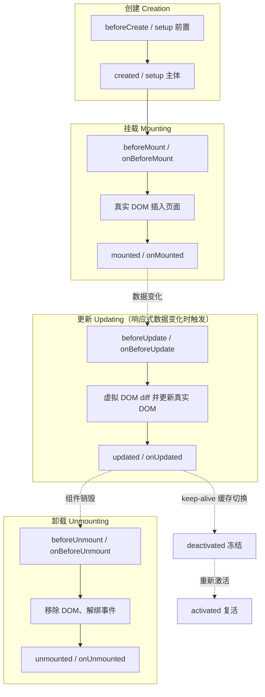
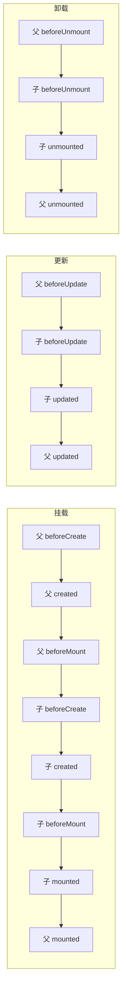

# Vue 生命周期（Vue 2 vs Vue 3）

- date: 2026-08-13
- tags: [Vue, 生命周期, Options API, Composition API]
- summary: 用"仓库单据从创建到归档"做比喻，讲清 Vue 组件从创建、挂载、更新到卸载的完整旅程；对照 Vue 2 / Vue 3 两套写法、父子组件顺序、keep-alive 钩子，附可直接背的面试话术。

## 概述 / Overview

> 一句话先说结论：
> **Vue 组件的生命周期，就是"创建 → 挂载 → 更新 → 卸载"四个阶段，每个阶段前后各有钩子（hook）让你插入代码；Vue 3 里换了个写法（`setup` + `onXxx`），但阶段没变。** 所有阶段里，99% 的日常代码只用得到 `setup`/`created`、`mounted`、`beforeUnmount` 这三个。

想象一张 WMS 收货单（InboundOrder）从生成到归档的流转：

1. **开单（创建）**：先有单据壳子（beforeCreate），再填上客户、SKU、数量等明细（created）。此时单子还在内存里，没上屏幕。
2. **打印上墙（挂载）**：模板渲染成真页面，贴到看板（beforeMount → mounted）。此刻才能摸到页面上的元素（`ref`）。
3. **改单（更新）**：仓库员扫错数量改一下，页面局部重刷（beforeUpdate → updated）。
4. **归档（卸载）**：单据作废/页面关掉，先清理监听、停掉定时器（beforeUnmount），再彻底销毁（unmounted）。



- **灰色箭头**：`beforeUpdate/updated` 不是每次渲染都触发，只有"被模板用到的响应式数据"变化才走这轮。
- **右侧虚线**：组件被 `<keep-alive>` 包裹时，缓存切换走的是 `activated/deactivated`，**不会**反复走挂载/卸载。

---

## 核心知识点 / Key Points

### 1. 两套写法对应关系（最重要的对照表）

Vue 3 同时支持两种写法；Vue 2 只有 Options API。同名钩子在 Vue 3 里**默认仍是 Options API 风格**（也兼容），Composition API 则用 `setup` + 函数形式：

| 阶段 | Vue 2 | Vue 3 Options API | Vue 3 Composition API |
|------|-------|-------------------|------------------------|
| 创建 | `beforeCreate` / `created` | `beforeCreate` / `created` | `setup()`（替代两者） |
| 挂载 | `beforeMount` / `mounted` | 同名 | `onBeforeMount` / `onMounted` |
| 更新 | `beforeUpdate` / `updated` | 同名 | `onBeforeUpdate` / `onUpdated` |
| 卸载 | `beforeDestroy` / `destroyed` | `beforeUnmount` / `unmounted` | `onBeforeUnmount` / `onUnmounted` |
| 缓存 | `activated` / `deactivated` | 同名 | `onActivated` / `onDeactivated` |
| 错误 | `errorCaptured` | 同名 | `onErrorCaptured` |
| 调试 | 无 | `renderTracked` / `renderTriggered`（仅开发环境） | `onRenderTracked` / `onRenderTriggered` |

**三个最容易记混的差异点：**

1. **`beforeDestroy/destroyed` → `beforeUnmount/unmounted`**：Vue 3 改名（"销毁"改成"卸载"，语义更准确）。老代码照抄进 Vue 3 会直接**失效不报错**——这是 Vue 2 迁 Vue 3 最常见的坑。
2. **`created`/`beforeCreate` 被 `setup()` 替代**：`setup()` 在 `beforeCreate` **之前**就执行（Composition API 顶层代码 = 创建阶段的全部逻辑）。
3. **钩子要注册在 `setup()` 同步代码里**：`onMounted(fn)` 等必须同步调用，不能写在 `await` 之后或异步回调里。

### 2. 四个阶段分别能干什么（配合 WMS 业务）

以"收货扫描页 InboundScan.vue"为例（Vue 3 Composition API）：

```vue
<script setup>
import { ref, onMounted, onBeforeUnmount } from 'vue'

// 创建阶段：初始化状态（替代 beforeCreate + created）
const orderNo = ref('')
const scannedList = ref([])
const scanInput = ref(null)          // 待挂载后用来定位输入框的 ref

// 挂载阶段：DOM 已就绪，拉取单据头、聚焦扫描框
onMounted(async () => {
  const { data } = await fetch(`/api/inbound/${orderNo.value}`)
  orderNo.value = data.orderNo
  scanInput.value?.focus()           // 能摸到 DOM 了
})

// 卸载阶段：清掉扫码枪的全局键盘监听，防止内存泄漏
onBeforeUnmount(() => {
  window.removeEventListener('keydown', onScanKey)
})
</script>
```

| 钩子 | 能用 / 不能用 | 典型用途 |
|------|--------------|---------|
| `setup` / `created` | 可访问 data/computed/方法；**没有 DOM**、`ref` 为 null | 初始化数据、定义状态、发起不依赖 DOM 的请求（如查单据头） |
| `onBeforeMount` | 响应式状态已就绪，`$el` 还没有 | 渲染前最后一次改数据（很少用） |
| `onMounted` | **`$el`/`ref` 可用**，可访问真实 DOM | 聚焦输入框、初始化第三方图表/地图、发"等页面再请求"的接口 |
| `onBeforeUpdate` | DOM 还是旧值 | 更新前读旧 DOM 状态（如记住滚动位置） |
| `onUpdated` | DOM 已是新值 | 更新后做依赖 DOM 的操作（慎用，避免再改数据造成死循环） |
| `onBeforeUnmount` | 实例仍完整可用 | 保存现场、上报数据、清定时器/解绑事件/取消订阅 |
| `onUnmounted` | 已销毁，只剩清理 | 清理定时器、移除事件监听、销毁第三方实例 |

> 面试常考一问：**请求放 `created` 还是 `mounted`？**
> 答：不依赖 DOM 的请求放 `created`（早发早好）；要等页面元素就绪的（比如图表要挂在某个节点上）放 `mounted`。两者本质都在"首次渲染前/后"各执行一次，Vue 2 里放 `created` 更早，Vue 3 放 `setup` 即可。

### 3. 父子组件嵌套的顺序（高频面试题）

口诀：**创建"父先子"、挂载"子先父"、更新"父前子前、子完父完"、卸载"父前子前、子完父完"。**



- **挂载**：父组件先建壳、再轮到子组件整条流程，最后父组件才算挂载完成——**父 `mounted` 一定在子 `mounted` 之后**。
- **更新**：只有"父传给子的数据"变化且被子组件用到时，子才跟着更新；顺序永远是 `父 beforeUpdate → 子 beforeUpdate → 子 updated → 父 updated`。
- **卸载**：`父 beforeUnmount → 子 beforeUnmount → 子 unmounted → 父 unmounted`（Vue 2 对应 `beforeDestroy/destroyed`）。

> 理解原因（一句话）：父组件负责"包住"子组件，所以**建壳先建、收尾后收**——DOM 要等子组件插完才整体上墙，卸载时先把孩子拆干净自己才走。

### 4. keep-alive 的额外钩子：activated / deactivated

`<keep-alive>` 包裹的组件，切换离开时**不会卸载**，只是"冻结"，回来时"复活"：

```vue
<keep-alive>
  <component :is="currentTab" />   <!-- 拣货单/复核单/装车单来回切 -->
</keep-alive>
```

- `onActivated`：组件被缓存后**再次进入**时触发（等同"页面回来了"）。
- `onDeactivated`：组件被缓存**移出视图**时触发（等同"页面被藏起来"）。
- 与 mounted/unmounted 的关系：**首次进入**会先 mounted 再 activated；之后切换只走 activated/deactivated，不再走 mounted/unmounted。

典型用法（WMS）：拣货页切到复核页再切回来，`onActivated` 里刷新当前波次进度、重新聚焦扫码框；`onDeactivated` 里暂停轮询接口。

### 5. 初始化与清理要"成对出现"

- `setup` 里 `addEventListener` → `onBeforeUnmount` 里 `removeEventListener`
- `onMounted` 里 `setInterval` → `onBeforeUnmount` 里 `clearInterval`
- `onMounted` 里 new 一个图表 → `onBeforeUnmount` 里 `destroy()`

不做清理的后果：组件销毁了，定时器/监听还在跑，改数据时操作已卸载的 DOM → **内存泄漏 + 控制台警告**。

---

## 代码示例 / Code Example

（本主题未建独立可运行项目。把下面这份最小 Vue 3 单文件组件贴进任意 Vite + Vue 项目，或 `vue create` 出来的 App.vue 里，打开控制台即可看到完整生命周期日志。）

```vue
<script setup>
import { onMounted, onUpdated, onBeforeUnmount, onUnmounted, onActivated, onDeactivated, ref } from 'vue'

const qty = ref(1)

console.log('[setup] 创建阶段（替代 beforeCreate/created）')

onBeforeMount(() => console.log('[onBeforeMount] 即将渲染，DOM 还没有'))
onMounted(() => console.log('[onMounted] 已挂载，可以操作 DOM'))

onBeforeUpdate(() => console.log('[onBeforeUpdate] 数据变了，DOM 还是旧值'))
onUpdated(() => console.log('[onUpdated] DOM 已更新'))

onActivated(() => console.log('[onActivated] keep-alive 复活'))
onDeactivated(() => console.log('[onDeactivated] keep-alive 冻结'))

onBeforeUnmount(() => console.log('[onBeforeUnmount] 卸载前：清定时器/解绑事件'))
onUnmounted(() => console.log('[onUnmounted] 已卸载'))
</script>

<template>
  <p>数量：{{ qty }}</p>
  <button @click="qty++">点我触发 更新阶段</button>
  <button @click="$el.parentNode?.removeChild($el)">点我触发 卸载阶段</button>
</template>
```

在父组件里加个 `v-if` 来切换子组件，并给子组件外层包 `<keep-alive>`，可以同时观察"挂载/更新/卸载"和"activated/deactivated"两套日志的区别。

---

## 面试回答话术 / Interview Q&A

> 每条约 30~60 字，可直接背。先自己默答，再看答案。

**Q1：Vue 组件的生命周期分几个阶段，各是什么？**
A：创建、挂载、更新、卸载四阶段。创建初始化数据，挂载把模板渲染进真实 DOM，更新在响应式数据变化时重渲染，卸载做清理并销毁组件。

**Q2：Vue 3 里 `created` 和 `beforeCreate` 去哪了？**
A：被 `setup()` 替代。setup 在 beforeCreate 之前执行，它顶层的代码就是原 beforeCreate/created 的逻辑，其余钩子用 onMounted 等函数形式在 setup 中注册。

**Q3：`mounted` 和 `created` 的区别？请求放哪个？**
A：created 时没有 DOM、ref 为 null；mounted 后 DOM 与 ref 可用。不依赖 DOM 的请求放 created（更早发），要操作 DOM 的初始化放 mounted。

**Q4：父子组件挂载的生命周期顺序？**
A：父 beforeCreate→父 created→父 beforeMount→子 beforeCreate→子 created→子 beforeMount→子 mounted→父 mounted。父先建壳，子先挂完，父才完成挂载。

**Q5：更新和卸载阶段父子组件顺序？**
A：更新是父 beforeUpdate→子 beforeUpdate→子 updated→父 updated；卸载是父 beforeUnmount→子 beforeUnmount→子 unmounted→父 unmounted。父先发起，子先完成。

**Q6：`beforeDestroy/destroyed` 和 `beforeUnmount/unmounted` 什么关系？**
A：同一钩子，Vue 3 改名。beforeDestroy/destroyed 是 Vue 2 的叫法，Vue 3 更名为 beforeUnmount/unmounted，语义更准确，老代码需同步改名。

**Q7：keep-alive 组件切换时生命周期怎么走？**
A：首次进入先 mounted 再 activated；之后切走触发 deactivated（冻结但不销毁），切回触发 activated（复活），不再走 mounted/unmounted。

**Q8：如何防止 Vue 组件内存泄漏？**
A：在 beforeUnmount/unmounted 中成对清理：clearInterval 定时器、removeEventListener 监听、取消订阅、销毁图表实例等 onMounted/setup 中创建的副作用。

**Q9：Composition API 钩子能写在异步回调里吗？**
A：不能。onMounted 等必须在 setup 同步执行期间注册，写在 await 之后或 setTimeout 里会丢失当前组件实例而失效。

---

## 参考链接 / References

- [Vue 3 官方 - 生命周期钩子（指南）](https://cn.vuejs.org/guide/essentials/lifecycle.html)
- [Vue 3 官方 - 生命周期选项 API](https://cn.vuejs.org/api/options-lifecycle.html)
- [Vue 3 官方 - 组合式 API 生命周期钩子](https://cn.vuejs.org/api/composition-api-lifecycle.html)
- [Vue 3 官方 - keep-alive（内置组件）](https://cn.vuejs.org/guide/built-ins/keep-alive.html)
- [Vue 2 官方 - 实例生命周期（旧文档）](https://v2.cn.vuejs.org/v2/guide/instance.html)

---

## 踩坑记录 / Troubleshooting

| 现象 | 原因 | 解决办法 |
|------|------|----------|
| Vue 3 里写 `beforeDestroy` 不执行 | Vue 3 已改名 `beforeUnmount`，旧名静默失效 | 全局搜索改名：`beforeDestroy→beforeUnmount`、`destroyed→unmounted` |
| `onMounted` 注册的钩子不触发 | 在 `await` 之后 / 异步回调里调用 `onMounted`，丢了当前实例 | 生命周期钩子必须在 `setup()` 同步代码里注册 |
| `mounted` 里拿 `this.$refs.xxx` 是 undefined | 挂载钩子执行时机在渲染前，或 ref 用了 `v-if` 还没渲染出来 | 确认放到 `mounted`（而非 `created`）；用 `v-if` 控制时改成 `nextTick` 后再拿 |
| 组件销毁后定时器还在跑、控制台报"避免直接改已卸载组件" | onMounted 里 `setInterval` 没在 beforeUnmount 里清除 | 成对清理：`onBeforeUnmount(() => clearInterval(timer))` |
| `updated` 里改数据导致无限重渲染 | updated 中又修改了响应式数据 → 再次触发更新 | 避免在 updated 里改数据；改用 `watch` 或 `nextTick` |
| 切换 `<keep-alive>` 页面不走 mounted | keep-alive 缓存组件后不再重新挂载，改走 activated | 需要每次进入都刷新的逻辑放 `onActivated`，而不是 `mounted` |
| 页面首次进入 activated 比 mounted 晚、且重复执行 | 首次激活会 mounted+activated 连发，且被缓存后每次进都 activated | 用标志位（如 `isFirst`）区分首次与非首次，只让重复逻辑在非首次执行 |
| 父组件数据变了子组件不更新 | 父没把该数据传给子组件，或子组件没把它用于模板 | 确认 prop 传递且模板中使用了；子组件若不使用传入值则不会触发更新钩子 |
