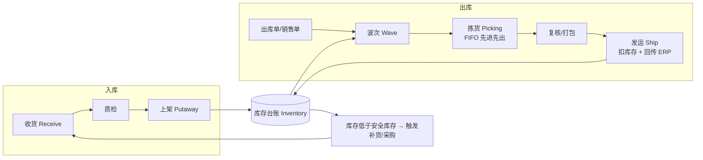
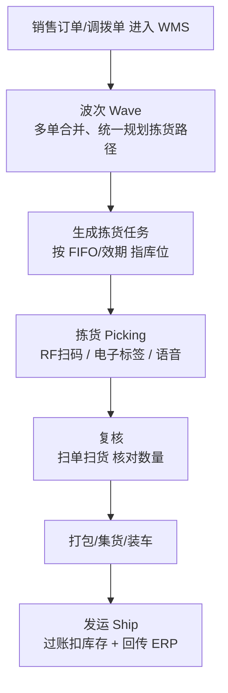

# WMS 业务流程闭环（供应链 + 面试速成）

- date: 2026-08-19
- tags: [WMS, 仓库管理, 供应链, 业务闭环, 面试]
- summary: 面向供应链求职与实习复盘：用一套"收货 → 上架 → 库存 → 拣货 → 出库 → 补货"的闭环模型讲透 WMS 在干什么，并给出"上家公司 WMS 做了什么"的面试答法。

## 概述 / Overview

WMS（Warehouse Management System）是**仓库管理系统**，管的是仓库里"货"的全生命周期：

> **货怎么进来（收货）→ 放在哪（上架）→ 现在还有多少（库存）→ 怎么拿出去（拣货出库）→ 账和实物对不对（盘点）**

一句话记住 WMS 的三大目标：

> **账实一致**（系统库存 = 实物库存）
> **作业高效**（该放哪、拿什么、怎么走，系统算好，人少跑冤枉路）
> **全程可追溯**（每一件货从进门到出门都有记录）

**业务闭环**：库存是中心，所有动作都在增减库存。收货加库存、出库减库存，库存少了触发补货，补货又回到收货 —— 一圈一圈转起来，就叫闭环。

---

## 核心知识点 / Key Points

### 1. WMS 在供应链中的位置

供应链大致是：**采购 → 仓储（WMS）→ 配送（TMS）→ 门店/客户**。WMS 是中间的"蓄水池"和"中转站"，上游接采购/供应商到货，下游把订单货发出去。

**和 ERP 的分工**（面试高频，必须分清）：

| | ERP | WMS |
|---|---|---|
| 管什么 | 单据 + 账 + 财务 | 仓内**物理执行动作** |
| 例子 | 采购单、销售单、库存财务账 | 收货、上架、拣货、发运 |
| 关系 | 下发采购/销售单给 WMS | 执行完过账，回传结果同步库存账 |

> 一句话：**ERP 管"账"，WMS 管"货"**。两边通过接口同步，账实才能对上。

### 2. 基础主数据（先有"地方"和"货"才能干活）

- **仓库 / 库区 / 库位**：仓内地址体系，如 `库区A → 巷道01 → 货架01 → 层2 → 位3`，库位是收货上架的最小位置单位。
- **SKU（物料）**：商品唯一标识，货的"身份证"。
- **批次 / 效期**：同一 SKU 不同时间进来的货要分开管（先进先出、效期管理的前提）。
- **库存状态**：可用（能拣货）、待上架/质检（刚收货还没就位）、冻结（质量/锁定，不可用）、在途（还没到库）。
- **容器/托盘**：周转工具，一托可放多箱，按托移动提高效率。

### 3. 业务闭环总览



### 4. 入库流程：收货 → 质检 → 上架

```mermaid
flowchart TD
    A[上游采购单/补货单<br/>生成收货单 ASN 预到货] --> B[到货：扫码/清点 收货<br/>记录数量、批次、效期]
    B --> C{需要质检?}
    C -- 是 --> D[质检区 抽检]
    C -- 否 --> E
    D --> E[上架 Putaway<br/>系统按库位策略推荐库位]
    E --> F[确认上架 → 库存变"可用"]
    F --> G[回传 ERP 同步库存账]
```

要点：
- **ASN（预到货通知）**：货还没到，系统先知道要来什么，可提前安排收货台和库位。
- **收货时记批次/效期**：这是后面 FIFO 拣货的前提，忘了记后面全乱。
- **上架推荐库位**：按 SKU 属性（ABC 分类、体积、效期）推荐库区，人按提示放，而不是随手放。

### 5. 出库流程：波次 → 拣货 → 复核 → 发运



要点：
- **波次**：把同一时间、同区域的出库单合并成一批，一起规划拣货路线，少跑路。
- **FIFO（先进先出）**：按批次顺序拣，最早的批次先出，防止库存过期积压；生鲜药品用 FEFO（效期优先）。
- **复核**：拣货靠人，复核是最后一道防错门：扫单号、扫货品、核数量，错了当场拦。
- **发运过账**：库存扣减的一刻，回传 ERP，两边账才同步。

### 6. 库内作业：盘点 / 补货 / 移库 / 越库

- **盘点**：循环盘点（按库位分批盘）或全盘，盘完处理差异——多了入库调整、少了出库调整，保证账实一致。
- **补货**：货从**存储位**补到**拣货位**（拣货位小、放高流转 SKU），拣货位低于安全库存就触发补货任务。
- **移库**：库位调整（货品冷热转移、合并空位）。
- **越库（Cross-Docking）**：到货**不经过上架存储**，直接对接出库/转运，货到即走，减少搬运和库存占用（适合高周转商品）。
- **冻结/解冻**：质量异常、锁定商品不能发，冻结的库存不参与可用拣货。

### 7. 库存管理：台账是心脏

- **库存台账**：`SKU + 批次 + 库位 + 状态 + 数量` 是每一笔库存的档案，收、发、盘、调都写它。
- **可用 vs 冻结**：只有可用库存能拣货出库，避免发到坏货。
- **防超卖/防负库存**：出库扣减必须"事务 + 行锁 + 条件更新"（详见 [Database 笔记](../Database/TransactionIsolation.md) 的 WMS 库存扣减实战）。
- **过账要同事务**：加库存 + 记流水 + 更单据状态必须一起成功（详见 [EF-Core 事务笔记](../EF-Core/EFCoreTransaction.md)）。

### 8. 关键概念小词典

| 词 | 一句话 |
|---|---|
| ASN | 预到货通知：货未到，先知道要收什么 |
| 波次 | 多张出库单合并成一个拣货批次，统一路径 |
| 越库 | 到货不存储，直接出库/转运，货到即走 |
| FIFO / FEFO | 先进先出 / 效期优先，决定先拣哪批 |
| 库位策略 | 系统按规则（ABC 分类/体积/效期）推荐放哪 |
| 盘点 | 账实核对，差异调整 |
| 补货 | 存储位 → 拣货位的搬运 |
| 可用/冻结/待上架 | 库存状态，决定能不能拣 |

---

## 面试场景：上家公司 WMS 做了什么？

面试官这么问，不是在考你会不会背流程，而是想听**你理解业务、能说清自己在里面干了什么**。按三段式答：

### 答法模板（把 XX 替换成你的实际情况）

1. **一句话定位**：我实习参与的是 XX 行业（如电商/医药/三方仓）的 WMS，主要负责 XX 模块（如收货入库 / 出库波次 / 库存查询）。
2. **按闭环讲**：WMS 的核心是"收货 → 上架 → 拣货 → 出库 → 盘点"的闭环，所有功能都围绕库存台账增减。我这边是 XX 环节，做的是 XX（例如：做收货单录入和 ASN 校验、做拣货波次分配、做库存扣减防超卖）。
3. **举一个"业务 + 技术"结合的例子**：选一件你真正做过的事，一句话说业务、一句话说技术。比如：

> "我做的是出库拣货模块。业务上：销售单进 WMS 后按波次合并，再按 FIFO 批次分配库位去拣货。技术上：库存扣减用事务 + 行锁 + 条件更新防超卖，拣货单生成走了 EF Core 显式事务保证过账一致。"

**反例别踩**：只报功能清单（"我做了收货、出库、盘点"）等于没答；一定要落到"你负责哪一段 + 遇到什么问题 + 怎么解决的"。

### 如果你实在想不起做了什么

诚实但往业务上靠：**"我们用的是 XX（WMS 产品/自研），我的任务主要是 XX 模块的前后端开发，我借这段经历把收货入库、波次拣货、库存扣减这些流程捋清楚了，现在能完整讲清一条货从进到出的链路。"** —— 面试官要的就是你能讲清链路。

---

## 代码示例 / Code Example

可运行完整代码见同级目录 → [WMS/](./WMS/)

运行方式：`dotnet run`（见该目录 README）。

用一段"仓库一天"的模拟把闭环跑一遍：收货（待上架）→ 上架（可用）→ 波次合并 → FIFO 拣货 → 发运扣库存 → 低库存触发补货 → 缺货拦截。运行输出能看到每步库存变化，对应上面的流程图。

建议动手改一改：给拣货改成 FEFO（按效期排序）；给 `PickFifo` 加并发演练；新增盘点功能做账实调整。

---

## 面试回答话术 / Interview Q&A

> 每条约 30~60 字，可直接背。先自己默答，再看答案。

**Q1：WMS 是什么？解决什么问题？**
A：仓库管理系统，管货的全生命周期：收货、上架、库存、拣货出库、盘点。三大目标：账实一致、作业高效、全程可追溯。

**Q2：WMS 的业务闭环是什么？**
A：收货→质检→上架→库存→波次拣货→复核→发运→库存减少→补货再入库。库存台账是中心，所有动作都是围绕它增减，循环即闭环。

**Q3：收货入库流程？**
A：上游采购/补货单生成收货单(ASN)→到货扫码清点收货，记数量批次效期→质检→上架到系统推荐库位，确认后库存变可用。

**Q4：出库（拣货发货）流程？**
A：销售单进 WMS→波次合并→生成拣货任务→按 FIFO/效期拣货→复核核对→打包集货→发运过账扣库存并回传 ERP。

**Q5：什么是波次？**
A：把多张出库单按规则合并成一个拣货批次，统一规划拣货路径，减少往返、提高拣货效率，通常按同一库区/同一波次汇总。

**Q6：什么是越库？**
A：到货不进入存储上架，直接对接出库或转运，货到即走，减少搬运和库存占用，适合高流转、短效期商品。

**Q7：WMS 和 ERP 的区别与关系？**
A：ERP 管单据和账（采购单、销售单、财务库存），WMS 管仓内执行动作（收货、上架、拣货）；ERP 下发单据，WMS 执行过账回传，保证账实一致。

**Q8：库存有哪些状态？**
A：可用、待上架/质检、在途、冻结等。只有可用库存能拣货出库；冻结（质量/锁定）不参与可用，防止发错货。

**Q9：先进先出（FIFO）怎么实现？**
A：收货时按批次记录，拣货时按批次/效期排序，先拣最早入库或最早过期的批次，再按需跨库位取货。

**Q10：你上家公司 WMS 做了什么？（怎么答）**
A：三段式：一句话定位（什么行业、负责哪模块）→ 按闭环讲自己参与的环节 → 举一个业务+技术结合的例子（如 FIFO 拣货、防超卖）。

---

## 参考链接 / References

- [维基百科 - 仓库管理系统（WMS）](https://zh.wikipedia.org/wiki/%E8%BD%AF%E4%BB%B6%E4%BB%93%E5%BA%93%E7%AE%A1%E7%90%86%E7%B3%BB%E7%BB%9F)
- 仓库内跨笔记联动：库存扣减防超卖见 [Database 事务笔记](../Database/TransactionIsolation.md)；收货过账事务见 [EF-Core 显式事务](../EF-Core/EFCoreTransaction.md)；收货入库 DDD 建模见 [DDD 笔记](../DDD/DDD.md)

---

## 踩坑记录 / Troubleshooting

| 现象 | 原因 | 解决办法 |
|------|------|----------|
| 系统库存和实物对不上 | 收发货漏扫/错扫、盘点不及时 | 扫码强制校验、出库复核、定期盘点差异调整 |
| 库存账和 ERP 不一致 | WMS 过账与 ERP 同步不是事务/接口丢消息 | 过账接口幂等 + 定时对账任务核对两边库存 |
| 拣货位断货 | 补货不及时、无安全库存预警 | 设安全库存，低于阈值自动生成补货任务 |
| 负库存/超卖 | 并发扣减无锁或条件更新 | 事务 + 行锁 + 条件更新（见 Database 笔记） |
| 先进先出失效 | 收货没记批次、拣货没按批次排序 | 收货强制录批次效期，拣货按批次顺序指库位 |
| 发错货/发坏货 | 复核缺失、冻结库存参与了拣货 | 出库必经复核；冻结/质检库存不参与可用拣货 |